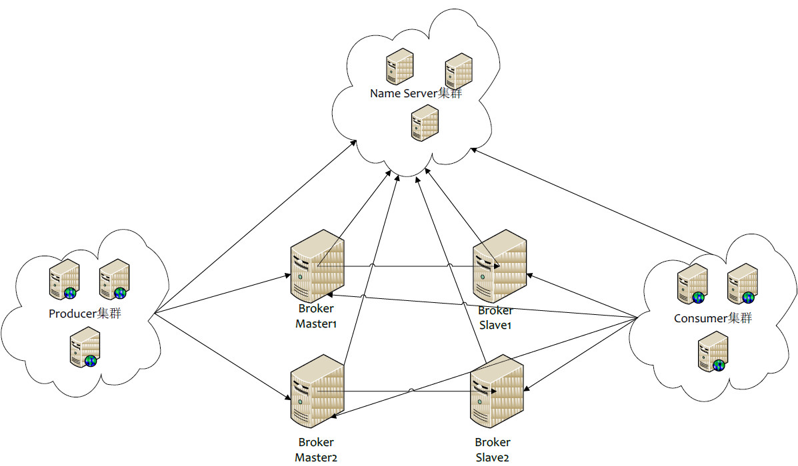

[TOC]

#  MQ学习

> 作用：MQ中最大的作用就是将系统进行解耦操作，减缓主系统的接口压力；
>
> 特点：解耦 | 削峰 | 异步

## 1.MQ目前流行的几种框架

| 语言     | 编程语言 | JMS规范     | 吞吐量 | 事物 | 可用性               |
| -------- | -------- | :---------- | ------ | ---- | -------------------- |
| kafka    | Scala    |             | 十万级 |      | 非常高（分布式架构） |
| activeMq | Java     | 符合JMS规范 | 万级   | 支持 | 高（主从）           |
| rabbitMq | erlang   | 符合JMS规范 | 万级   |      | 高（主从）           |
| rockeMq  | Java     |             | 十万级 |      | 非常高（分布式架构） |

##  2.activeMQ学习

> 官网：http://activemq.apache.org
>
> 安装包：直接在官网下载最新的：这里使用的是ActiveMQ 5.16.1 (Jan 20, 2021)
>
> 默认端口：61616
>
> 两大模式：
>
> ​	point-to-point（1-1）: sender    --------------->   queue    
>
> ​    Publish-and-Subscribe（1-Many）:   publisher  --------------> topic 

### 2.0 JMS

> JMS包含四大属性（一下以activeMq为例）；

* JMS provider：实现JMS接口和规范的消息中间件，也就是我们的MQ服务器；
* JMS produce： 消息生产者，创建和发送JMS消息的客户端应用；
* JMS consumer：消息消费者，接收和处理JMS消息的客户端应用；
* JMS message
  * 消息头
    * JMSDestination    （JMS目标地）要么是队列 || 要么是主题
    * JMSDeliveryMode  （JMS交付模式 ）持久和非持久模式 ；非持久就传递一次，一次过后不管成功与否，消息都没有了。
    * JMSExpiration   （JMS过期） 如果设置成0，则说明该消息永不过期；默认就是永不过期。
    * JMSPriority   （JMS优先级） 0-9：0-4是普通，5-9是加急，JMS不是严格按照优先级排序，但是加急的消息一定是比普通的消息要先到达。
    * JMSMessageId  消息id ：消息的幂等性用到
  * 消息体
    * TextMessage 普通字符串消息，包含一个string
    * MapMessage 一个Map类型的消息，key为string，value为Java的基本类型
    * BytesMessage 二进制数组消息
    * StreamMessage   Java数据流消息
    * ObjectMessage  对象消息，包含一个可序列化的Java对象
  * 消息属性
    * 他们是以「属性名」和「属性值」的形式制定的；可以将属性视为消息头的扩展，属性可以指定一些消息头没有涵盖的附加信息，比如可以在消息属性中指定消息选择器；

### 2.1 命令相关

#### 2.1.1 启动命令

````
> 启动：
	 bin/activemq start
> 重新启动
	bin/activemq restart
> 带日志的启动
  bin/activemq start > ./log/myActiveMq.log
> 指定配置文件启动
  bin/activemq start xbean:file:/user/.../activemq.xml
````

#### 2.1.2查看启动

````
jps 
ps -ef|grep activemq
netstat -anp|grep 61616
lsof -i:61616
````

#### 2.1.3 关闭

````
bin/activemq stop
````

### 2.2 activeMq控制台

````
默认访问连接：http://localhost:8161/admin/
默认用户和密码： admin/admin
````

### 2.3 开发简单activeMq项目

#### 2.3.1 xml文件

````xml
				<!--activemq包-->
        <dependency>
            <groupId>org.apache.activemq</groupId>
            <artifactId>activemq-all</artifactId>
            <version>5.15.9</version>
        </dependency>
        <dependency>
            <groupId>org.apache.xbean</groupId>
            <artifactId>xbean-spring</artifactId>
            <version>3.16</version>
        </dependency>
````

#### 2.3.2  queue格式

##### 2.3.2.1 生产者（queue）

````java
package mq_001;

import org.apache.activemq.ActiveMQConnectionFactory;

import javax.jms.*;

public class JmsProduce {
    public static final String ACTIVE_URL = "tcp://127.0.0.1:61616";
    public static final String QUEUE_NAME = "queue01";
    public static void main(String[] args) throws JMSException {
        //1:创建连接工厂，才用默认的用户名和密码
        final ActiveMQConnectionFactory factory = new ActiveMQConnectionFactory(ACTIVE_URL);
        //2：通过连接工程，获取连接connection并启动访问
        final Connection connection = factory.createConnection();
        connection.start();
        //3:创建会话session（两个参数：第一个是事物；第二个是签收）
        final Session session = connection.createSession(false, Session.AUTO_ACKNOWLEDGE);
        //4:创建目的地（具体是队列或者主题）
        final Destination destination = session.createQueue(QUEUE_NAME);
        //5:创建消息的生产者
        final MessageProducer producer = session.createProducer(destination);
        //6:通过生产者生产3条消息发送到MQ队列中
        for (int i = 0; i < 4; i++) {
            //7:创建消息
            final TextMessage message = session.createTextMessage("msg----" + i);
            //8:通过生产者上传
            producer.send(message);
        }
        //9:释放资源
        producer.close();
        session.close();
        connection.close();

        System.out.println("*************消息发布成功***********");

    }
}
````

##### 2.3.2.2 消费者1（queue）

````java
package mq_001;

import org.apache.activemq.ActiveMQConnectionFactory;

import javax.jms.*;
import java.util.Objects;

public class JmsConsumer {

    public static final String ACTIVE_URL = "tcp://127.0.0.1:61616";
    public static final String QUEUE_NAME = "queue01";

    public static void main(String[] args) throws JMSException {
        //1:创建连接工厂，才用默认的用户名和密码
        final ActiveMQConnectionFactory factory = new ActiveMQConnectionFactory(ACTIVE_URL);
        //2：通过连接工程，获取连接connection并启动访问
        final Connection connection = factory.createConnection();
        connection.start();
        //3:创建会话session（两个参数：第一个是事物；第二个是签收）
        final Session session = connection.createSession(false, Session.AUTO_ACKNOWLEDGE);
        //4:创建目的地（具体是队列或者主题）
        final Destination destination = session.createQueue(QUEUE_NAME);
        //5:创建消费者
        final MessageConsumer consumer = session.createConsumer(destination);
        while (true){
            /**
             * receive()方法：是说线程阻塞的，一直在这等着接收消息，所以textMessage不会为空
             * receive(long timeout)方法:是线程非阻塞的，一旦没有消息了，就会返回空
             */
            final TextMessage textMessage = (TextMessage) consumer.receive(3000);
            if (Objects.isNull(textMessage)){
                break;
            }
            System.out.println("****接收到的消息****"+textMessage.getText());
        }
        consumer.close();
        session.close();
        connection.close();
        System.out.println("*********consumer is end******");
    }
}

````

##### 2.3.2.3 消费者2（queue）

````java
package mq_001;

import lombok.SneakyThrows;
import org.apache.activemq.ActiveMQConnectionFactory;

import javax.jms.*;
import java.io.IOException;
import java.util.Objects;

public class JmsConsumer2 {

    public static final String ACTIVE_URL = "tcp://127.0.0.1:61616";
    public static final String QUEUE_NAME = "queue01";

    public static void main(String[] args) throws JMSException, IOException {
        //1:创建连接工厂，才用默认的用户名和密码
        final ActiveMQConnectionFactory factory = new ActiveMQConnectionFactory(ACTIVE_URL);
        //2：通过连接工程，获取连接connection并启动访问
        final Connection connection = factory.createConnection();
        connection.start();
        //3:创建会话session（两个参数：第一个是事物；第二个是签收）
        final Session session = connection.createSession(false, Session.AUTO_ACKNOWLEDGE);
        //4:创建目的地（具体是队列或者主题）
        final Destination destination = session.createQueue(QUEUE_NAME);
        //5:创建消费者
        final MessageConsumer consumer = session.createConsumer(destination);
        //6:通过监听方式接收消息
        consumer.setMessageListener(new MessageListener() {
            @SneakyThrows
            @Override
            public void onMessage(Message message) {
                if (Objects.nonNull(message)){
                    if (message instanceof TextMessage){
                        final TextMessage textMessage = (TextMessage) message;
                        System.out.println("*******接收到的消息2*******"+textMessage.getText());
                    }
                }
            }
        });
        System.out.println("*********consumer is end******");
        //保证控制台不灭，摁下任意键关闭,防止程序跑太快，监听器还没接收到消息就关闭了
        System.in.read();
        consumer.close();
        session.close();
        connection.close();
    }
}
````

##### 2.3.2.4 总结

````
情景一：一个生产者生产了6调数据，先启动一个消费者，此消费者消费6条后再启动另外一个消费者，那么之后启动的消费者将不会再接收到消息；
情景二：有两个消费者，一个生产者，生产者生产6条信息，两个消费端各消费三个；
````

#### 2.3.3 topic格式

##### 2.3.3.1 生产者（topic）

````java
package mq_002;

import org.apache.activemq.ActiveMQConnectionFactory;

import javax.jms.*;

public class JmsProduceTopic {
    public static final String ACTIVE_URL = "tcp://127.0.0.1:61616";
    public static final String QUEUE_NAME = "topic01";

    public static void main(String[] args) throws JMSException {
        //1:创建连接工厂，才用默认的用户名和密码
        final ActiveMQConnectionFactory factory = new ActiveMQConnectionFactory(ACTIVE_URL);
        //2：通过连接工程，获取连接connection并启动访问
        final Connection connection = factory.createConnection();
        connection.start();
        //3:创建会话session（两个参数：第一个是事物；第二个是签收）
        final Session session = connection.createSession(false, Session.AUTO_ACKNOWLEDGE);
        //4:创建目的地（具体是队列或者主题）
//        final Destination destination = session.createTopic(QUEUE_NAME); //和下面的一个意思
        final Topic topic = session.createTopic(QUEUE_NAME);
        //5:创建生产者
        final MessageProducer producer = session.createProducer(topic);
        //6:通过生产者生产3条消息发送到MQ队列中
        for (int i = 0; i < 4; i++) {
            //7:创建消息
            final TextMessage message = session.createTextMessage("msg----" + i);
            //8:通过生产者上传
            producer.send(message);
        }
        //9:释放资源
        producer.close();
        session.close();
        connection.close();

        System.out.println("*************消息发布成功***********");
    }
}

````

##### 2.3.3.2 消费者1 （topic）

````java
package mq_002;

import lombok.SneakyThrows;
import org.apache.activemq.ActiveMQConnectionFactory;

import javax.jms.*;
import java.io.IOException;
import java.util.Objects;

public class JmsConsumerTopic {
    public static final String ACTIVE_URL = "tcp://127.0.0.1:61616";
    public static final String QUEUE_NAME = "topic01";

    public static void main(String[] args) throws JMSException, IOException {

        System.out.println("***********我是一号消费者**********");
//        System.out.println("***********我是二号消费者**********");

        //1:创建连接工厂，才用默认的用户名和密码
        final ActiveMQConnectionFactory factory = new ActiveMQConnectionFactory(ACTIVE_URL);
        //2：通过连接工程，获取连接connection并启动访问
        final Connection connection = factory.createConnection();
        connection.start();
        //3:创建会话session（两个参数：第一个是事物；第二个是签收）
        final Session session = connection.createSession(false, Session.AUTO_ACKNOWLEDGE);
        //4:创建目的地（具体是队列或者主题）
        final Destination destination = session.createTopic(QUEUE_NAME);
        //5:创建消费者
        final MessageConsumer consumer = session.createConsumer(destination);
        //6:通过监听方式接收消息
        consumer.setMessageListener(message -> {
            if (Objects.nonNull(message)){
                if (message instanceof TextMessage){
                    final TextMessage textMessage = (TextMessage) message;
                    try {
                        System.out.println("*******接收到的消息*******"+textMessage.getText());
                    } catch (JMSException e) {
                        e.printStackTrace();
                    }
                }
            }
        });
        System.out.println("*********consumer is end******");
        //保证控制台不灭，摁下任意键关闭,防止程序跑太快，监听器还没接收到消息就关闭了
        System.in.read();
        consumer.close();
        session.close();
        connection.close();

    }
}

````

##### 2.3.3.3 消费者2（topic）

````java
package mq_002;

import org.apache.activemq.ActiveMQConnectionFactory;

import javax.jms.*;
import java.io.IOException;
import java.util.Objects;

public class JmsConsumerTopic2 {
    public static final String ACTIVE_URL = "tcp://127.0.0.1:61616";
    public static final String QUEUE_NAME = "topic01";

    public static void main(String[] args) throws JMSException, IOException {

//        System.out.println("***********我是一号消费者**********");
        System.out.println("***********我是二号消费者**********");

        //1:创建连接工厂，才用默认的用户名和密码
        final ActiveMQConnectionFactory factory = new ActiveMQConnectionFactory(ACTIVE_URL);
        //2：通过连接工程，获取连接connection并启动访问
        final Connection connection = factory.createConnection();
        connection.start();
        //3:创建会话session（两个参数：第一个是事物；第二个是签收）
        final Session session = connection.createSession(false, Session.AUTO_ACKNOWLEDGE);
        //4:创建目的地（具体是队列或者主题）
        final Destination destination = session.createTopic(QUEUE_NAME);
        //5:创建消费者
        final MessageConsumer consumer = session.createConsumer(destination);
        //6:通过监听方式接收消息
        consumer.setMessageListener(message -> {
            if (Objects.nonNull(message)){
                if (message instanceof TextMessage){
                    final TextMessage textMessage = (TextMessage) message;
                    try {
                        System.out.println("*******接收到的消息2*******"+textMessage.getText());
                    } catch (JMSException e) {
                        e.printStackTrace();
                    }
                }
            }
        });
        System.out.println("*********consumer is end******");
        //保证控制台不灭，摁下任意键关闭,防止程序跑太快，监听器还没接收到消息就关闭了
        System.in.read();
        consumer.close();
        session.close();
        connection.close();

    }
}

````

##### 2.3.3.4 总结

````
情景一：先启动一个消费者，再让一个生产者生产了6调数据，此消费者消费6条后再启动另外一个消费者，那么之后启动的消费者将不会再接收到消息；
情景二：启动两个消费者，再让生产者生产6条消息，那么这两个消费者将会同时收到这6条消息；
****************************************
注：针对publisher and subscribe模式，一定要先启动消费者；加入刚开始没有消费者，生产者直接启动，那么此时生产的消息就变成了废消息，即使之后启动的消费者也不会再接收这些之前的消息了！！！！
````

#### 2.3.4 activeMq持久性

##### 2.3.4.1 队列参数设置

````java
// 1：非持久化::当服务器宕机重启之后，消息不存在
producer.setDeliveryMode(DeliveryMode.NOT_PERSISTENT);
//2:持久化：当服务器宕机重启后，消息任然存在
producer.setDeliveryMode(DeliveryMode.PERSISTENT);
````

##### 2.3.4.2 activeMq 队列默认是持久化的

##### 2.3.4.3 activeMq 订阅参数设置（解决2.3.3.4遗留问题）

###### 2.3.4.3.1 topic持久化发送端

````java
package mq_003;

import org.apache.activemq.ActiveMQConnectionFactory;

import javax.jms.*;

public class JmsProduceTopicPersist {
    public static final String ACTIVE_URL = "tcp://127.0.0.1:61616";
    public static final String QUEUE_NAME = "topic_persist";

    public static void main(String[] args) throws JMSException {
        //1:创建连接工厂，才用默认的用户名和密码
        final ActiveMQConnectionFactory factory = new ActiveMQConnectionFactory(ACTIVE_URL);
        //2：通过连接工程，获取连接connection并启动访问
        final Connection connection = factory.createConnection();
        //3:创建会话session（两个参数：第一个是事物；第二个是签收）
        final Session session = connection.createSession(false, Session.AUTO_ACKNOWLEDGE);
        //4:创建目的地（具体是队列或者主题）
        final Topic topic = session.createTopic(QUEUE_NAME);
        //5:创建生产者
        final MessageProducer producer = session.createProducer(topic);
        producer.setDeliveryMode(DeliveryMode.PERSISTENT);
        //注意一定要在这里启动连接！！！！！
        connection.start();
        //6:通过生产者生产3条消息发送到MQ队列中
        for (int i = 0; i < 4; i++) {
            //7:创建消息
            final TextMessage message = session.createTextMessage("msg----" + i);
            //8:通过生产者上传
            producer.send(message);
        }
        //9:释放资源
        producer.close();
        session.close();
        connection.close();

        System.out.println("*************消息发布成功***********");
    }
}
````

###### 2.3.4.3.2 topic持久化消费端

````java
package mq_003;

import org.apache.activemq.ActiveMQConnectionFactory;

import javax.jms.*;
import java.io.IOException;
import java.util.Objects;

public class JmsConsumerTopicPersist {
    public static final String ACTIVE_URL = "tcp://127.0.0.1:61616";
    public static final String QUEUE_NAME = "topic_persist";

    public static void main(String[] args) throws JMSException, IOException {

        System.out.println("***********我是持久化消费者**********");

        //1:创建连接工厂，才用默认的用户名和密码
        final ActiveMQConnectionFactory factory = new ActiveMQConnectionFactory(ACTIVE_URL);
        //2：通过连接工程，获取连接connection并订阅
        final Connection connection = factory.createConnection();
        connection.setClientID("z3");
        //3:创建会话session（两个参数：第一个是事物；第二个是签收）
        final Session session = connection.createSession(false, Session.AUTO_ACKNOWLEDGE);
        //4:创建目的地（具体是队列或者主题）
        final Topic topic = session.createTopic(QUEUE_NAME);
        final TopicSubscriber durableSubscriber = session.createDurableSubscriber(topic, "remark...");
        connection.start();
        Message message = durableSubscriber.receive();
        while (Objects.nonNull(message)) {
            final TextMessage textMessage = (TextMessage) message;
            System.out.println("*******接收到的消息2*******" + textMessage.getText());
            message = durableSubscriber.receive();
        }
        session.close();
        connection.close();

    }
}
````

###### 2.3.4.3.3 总结

````
操作步骤：
	先启动消费端，让消费者「z3」先订阅上topic「topic_persist」；
	之后关闭消费端；
	起送生产端生产数据；
	最后启动消费端，任然能够接受数据；
````

#### 2.3.5 activeMq事物

##### 2.3.5.1 事物生产端

````java
package mq_004;

import org.apache.activemq.ActiveMQConnectionFactory;

import javax.jms.*;

public class JmsProduceTx {
    public static final String ACTIVE_URL = "tcp://127.0.0.1:61616";
    public static final String QUEUE_NAME = "queue01_tx";
    public static void main(String[] args) throws JMSException {
        final ActiveMQConnectionFactory factory = new ActiveMQConnectionFactory(ACTIVE_URL);
        final Connection connection = factory.createConnection();
        connection.start();
        final Session session = connection.createSession(true, Session.AUTO_ACKNOWLEDGE);
        final Destination destination = session.createQueue(QUEUE_NAME);
        final MessageProducer producer = session.createProducer(destination);
        try {
            //在这里处理业务逻辑
            for (int i = 0; i < 4; i++) {
                final TextMessage message = session.createTextMessage("msg----" + i);
                producer.send(message);
            }
            session.commit();
        }catch (Exception e){
            //报错直接回滚
            session.rollback();
        }
        producer.close();
        session.close();
        connection.close();
        System.out.println("*************消息发布成功***********");

    }
}
````

##### 2.3.5.2 事物消费端

````java
package mq_004;

import org.apache.activemq.ActiveMQConnectionFactory;

import javax.jms.*;
import java.util.Objects;

public class JmsConsumerTx {

    public static final String ACTIVE_URL = "tcp://127.0.0.1:61616";
    public static final String QUEUE_NAME = "queue01_tx";

    public static void main(String[] args) throws JMSException {
        final ActiveMQConnectionFactory factory = new ActiveMQConnectionFactory(ACTIVE_URL);
        final Connection connection = factory.createConnection();
        connection.start();
        final Session session = connection.createSession(true, Session.AUTO_ACKNOWLEDGE);
        final Destination destination = session.createQueue(QUEUE_NAME);
        final MessageConsumer consumer = session.createConsumer(destination);
        while (true){
            final TextMessage textMessage = (TextMessage) consumer.receive(3000);
            if (Objects.isNull(textMessage)){
                break;
            }
            System.out.println("****接收到的消息****"+textMessage.getText());
        }
        //这里如果没有commit，那么就会被MQ判定为未消费
        session.commit();
        consumer.close();
        session.close();
        connection.close();
        System.out.println("*********consumer is end******");
    }
}

````

#### 2.3.6 activeMq 签收

##### 2.3.6.1 签收简介

* 自动签收（默认）  Session.AUTO_ACKNOWLEDGE
* 手动签收
  * Session.CLIENT_ACKNOWLEDGE
  * 客户端调用acknowlege手动签收
* 允许重复消息 Session.DUPS_OK_ACKNOWLEDGE (很少用到)

##### 2.3.6.2 手动签收代码

````java
package mq_004;

import org.apache.activemq.ActiveMQConnectionFactory;

import javax.jms.*;
import java.util.Objects;
/**
主要针对消费者
*/
public class JmsConsumerTx {

    public static final String ACTIVE_URL = "tcp://127.0.0.1:61616";
    public static final String QUEUE_NAME = "queue01_tx";

    public static void main(String[] args) throws JMSException {
        final ActiveMQConnectionFactory factory = new ActiveMQConnectionFactory(ACTIVE_URL);
        final Connection connection = factory.createConnection();
        connection.start();
        final Session session = connection.createSession(true, Session.CLIENT_ACKNOWLEDGE);
        final Destination destination = session.createQueue(QUEUE_NAME);
        final MessageConsumer consumer = session.createConsumer(destination);
        while (true){
            final TextMessage textMessage = (TextMessage) consumer.receive(3000);
            if (Objects.isNull(textMessage)){
                break;
            }
            textMessage.acknowledge();
            System.out.println("****接收到的消息****"+textMessage.getText());
        }
        //这里如果没有commit，那么就会被MQ判定为未消费
        session.commit();
        consumer.close();
        session.close();
        connection.close();
        System.out.println("*********consumer is end******");
    }
}

````

#### 2.3.7 事物和签收注意

````java
如果「事物」开启了，那么就以「事物」优先，即使「签收」开启了，并且没有写「textMessage.acknowledge();」，也会被MQ定位为已经签收了；也就是说「事物」的优先级大于「签收」
````

#### 2.3.8 activeMq的Broker

````java
Broker 相当于一个activeMq的实例；
也就是说：Broker其实就是实现了用代码的形式启动ActiveMQ，将MQ嵌入到Java代码中，一遍随时启动，再用的时候在启动，这样能节省资源，也能保证可靠性；
````

````java
package mq_005;

import org.apache.activemq.broker.BrokerService;

/**
 * 嵌入到Java中的activeMQ
 */
public class EmbedBroker {
    public static void main(String[] args) throws Exception {

        BrokerService brokerService = new BrokerService();
        brokerService.setUseJmx(true);
        brokerService.addConnector("tcp://localhost:61616");
        brokerService.start();

    }
}
````

### 2.4 activeMQ整合Spring

#### 2.4.1 pom.xml文件

````xml
<?xml version="1.0" encoding="UTF-8"?>
<project xmlns="http://maven.apache.org/POM/4.0.0"
         xmlns:xsi="http://www.w3.org/2001/XMLSchema-instance"
         xsi:schemaLocation="http://maven.apache.org/POM/4.0.0 http://maven.apache.org/xsd/maven-4.0.0.xsd">
    <modelVersion>4.0.0</modelVersion>

    <groupId>com.maben</groupId>
    <artifactId>activemq-002-spring</artifactId>
    <version>1.0-SNAPSHOT</version>

    <properties>
        <project.build.sourceEncoding>utf-8</project.build.sourceEncoding>
        <maven.compiler.source>1.8</maven.compiler.source>
        <maven.compiler.target>1.8</maven.compiler.target>
    </properties>

    <dependencies>
        <!--整合spring start-->
        <dependency>
            <groupId>org.springframework</groupId>
            <artifactId>spring-jms</artifactId>
            <version>4.3.23.RELEASE</version>
        </dependency>
        <dependency>
            <groupId>org.springframework</groupId>
            <artifactId>spring-core</artifactId>
            <version>4.3.23.RELEASE</version>
        </dependency>
        <dependency>
            <groupId>org.springframework</groupId>
            <artifactId>spring-aop</artifactId>
            <version>4.3.23.RELEASE</version>
        </dependency>
        <dependency>
            <groupId>org.springframework</groupId>
            <artifactId>spring-orm</artifactId>
            <version>4.3.23.RELEASE</version>
        </dependency>
        <dependency>
            <groupId>org.aspectj</groupId>
            <artifactId>aspectjrt</artifactId>
            <version>1.6.1</version>
        </dependency>
        <dependency>
            <groupId>org.aspectj</groupId>
            <artifactId>aspectjweaver</artifactId>
            <version>1.9.5</version>
        </dependency>
        <dependency>
            <groupId>cglib</groupId>
            <artifactId>cglib</artifactId>
            <version>3.2.0</version>
        </dependency>

        <!--整合spring end-->

        <!--json依赖-->
        <dependency>
            <groupId>com.fasterxml.jackson.core</groupId>
            <artifactId>jackson-databind</artifactId>
            <version>2.11.3</version>
        </dependency>

        <!--activemq包-->
        <dependency>
            <groupId>org.apache.activemq</groupId>
            <artifactId>activemq-all</artifactId>
            <version>5.15.9</version>
        </dependency>
        <dependency>
            <groupId>org.apache.xbean</groupId>
            <artifactId>xbean-spring</artifactId>
            <version>3.16</version>
        </dependency>
        <dependency>
            <groupId>org.apache.activemq</groupId>
            <artifactId>activemq-pool</artifactId>
            <version>5.15.9</version>
        </dependency>


        <!--log包-->
        <dependency>
            <groupId>org.slf4j</groupId>
            <artifactId>slf4j-api</artifactId>
            <version>1.7.25</version>
        </dependency>
        <dependency>
            <groupId>ch.qos.logback</groupId>
            <artifactId>logback-classic</artifactId>
            <version>1.2.3</version>
        </dependency>
        <!--lombok包-->
        <dependency>
            <groupId>org.projectlombok</groupId>
            <artifactId>lombok</artifactId>
            <version>1.18.10</version>
        </dependency>
        <!--Junit包-->
        <dependency>
            <groupId>junit</groupId>
            <artifactId>junit</artifactId>
            <version>4.12</version>
        </dependency>
    </dependencies>

</project>
````

#### 2.4.2 spring配置文件

***主配置文件  applicationContext.xml***

````xml
<?xml version="1.0" encoding="UTF-8"?>
<beans xmlns="http://www.springframework.org/schema/beans"
       xmlns:xsi="http://www.w3.org/2001/XMLSchema-instance"
       xmlns:context="http://www.springframework.org/schema/context"
       xmlns:aop="http://www.springframework.org/schema/aop" xmlns:tx="http://www.springframework.org/schema/tx"
       xsi:schemaLocation="
        http://www.springframework.org/schema/beans
        http://www.springframework.org/schema/beans/spring-beans.xsd
        http://www.springframework.org/schema/context
        http://www.springframework.org/schema/context/spring-context.xsd
        http://www.springframework.org/schema/aop
        http://www.springframework.org/schema/aop/spring-aop.xsd
        http://www.springframework.org/schema/tx
        http://www.springframework.org/schema/tx/spring-tx.xsd ">

    <!-- 配置文件导入  -->
    <import resource="classpath:spring/*.xml"/>
</beans>
````

***扫描注解配置 anonation.xml***

````xml
<?xml version="1.0" encoding="UTF-8"?>
<beans xmlns="http://www.springframework.org/schema/beans"
       xmlns:xsi="http://www.w3.org/2001/XMLSchema-instance"
       xmlns:context="http://www.springframework.org/schema/context"
       xmlns:aop="http://www.springframework.org/schema/aop"
       xmlns:tx="http://www.springframework.org/schema/tx"
       xsi:schemaLocation="
        http://www.springframework.org/schema/beans
        http://www.springframework.org/schema/beans/spring-beans-4.0.xsd
        http://www.springframework.org/schema/context
        http://www.springframework.org/schema/context/spring-context-4.0.xsd
        http://www.springframework.org/schema/tx
        http://www.springframework.org/schema/tx/spring-tx-4.0.xsd
        http://www.springframework.org/schema/aop
        http://www.springframework.org/schema/aop/spring-aop-4.0.xsd
">
    <!--配置包的自动扫描-->
    <context:component-scan base-package="com.maben.activemqSpring"></context:component-scan>

</beans>
````

***activeMQ配置文件 activeMQ.xml***

````xml
<?xml version="1.0" encoding="UTF-8"?>
<beans xmlns="http://www.springframework.org/schema/beans"
       xmlns:xsi="http://www.w3.org/2001/XMLSchema-instance"
       xmlns:context="http://www.springframework.org/schema/context"
       xmlns:aop="http://www.springframework.org/schema/aop"
       xmlns:tx="http://www.springframework.org/schema/tx"
       xsi:schemaLocation="http://www.springframework.org/schema/beans
        http://www.springframework.org/schema/beans/spring-beans.xsd
        http://www.springframework.org/schema/tx
        http://www.springframework.org/schema/tx/spring-tx.xsd
        http://www.springframework.org/schema/mvc
        http://www.springframework.org/schema/context
        http://www.springframework.org/schema/context/spring-context.xsd
        http://www.springframework.org/schema/aop
        http://www.springframework.org/schema/aop/spring-aop.xsd
        http://www.springframework.org/schema/tx/spring-tx.xsd
">

    <!--配置生产者-->
    <bean id="jmsFactory" class="org.apache.activemq.pool.PooledConnectionFactory" destroy-method="stop">
        <property name="connectionFactory">
            <bean class="org.apache.activemq.ActiveMQConnectionFactory">
                <property name="brokerURL" value="tcp://127.0.0.1:61616"></property>
            </bean>
        </property>
        <property name="maxConnections" value="100"></property>
    </bean>


    <!--Destination **  point-to-point -->
    <bean id="destinationQueue" class="org.apache.activemq.command.ActiveMQQueue">
        <!--构造注入，设置自己的队列名称-->
        <constructor-arg index="0" value="my-queue-spring"></constructor-arg>
    </bean>

    <!--destination ** topic   publisher and subscribe-->
    <bean id="destinationTopic" class="org.apache.activemq.command.ActiveMQTopic">
        <!--通过构造注入，设置自己队列的名称-->
        <constructor-arg index="0" value="my-topic-spring"></constructor-arg>
    </bean>


    <!--Spring提供的工具类，他具有发送和接收消息等-->
    <bean id="jmsTemplate" class="org.springframework.jms.core.JmsTemplate">
        <property name="connectionFactory" ref="jmsFactory"></property>
        <property name="defaultDestination" ref="destinationQueue"></property>
        <!--<property name="defaultDestination" ref="destinationTopic"></property>-->
        <!--转换器-->
        <property name="messageConverter">
            <bean class="org.springframework.jms.support.converter.SimpleMessageConverter"></bean>
        </property>
    </bean>

    <!--配置监听器-->
    <bean id="jmsContainer" class="org.springframework.jms.listener.DefaultMessageListenerContainer">
        <property name="connectionFactory" ref="jmsFactory"></property>
        <property name="destination" ref="destinationQueue"></property>
        <property name="messageListener" ref="myListener"></property>
    </bean>

</beans>
````

#### 2.4.3 生产者

````java
package com.maben.activemqSpring.produce;

import org.springframework.beans.factory.annotation.Autowired;
import org.springframework.context.ApplicationContext;
import org.springframework.context.support.ClassPathXmlApplicationContext;
import org.springframework.jms.core.JmsTemplate;
import org.springframework.stereotype.Service;

import javax.jms.TextMessage;

/**
 * 注意这个消费者一次只能生产一条消息
 */
@Service
public class SpringMQProducer {
    @Autowired
    private JmsTemplate jmsTemplate;

    public static void main(String[] args){
        final ApplicationContext applicationContext = new ClassPathXmlApplicationContext("classpath:applicationContext.xml");
        SpringMQProducer springMQProducer = (SpringMQProducer) applicationContext.getBean("springMQProducer");
        springMQProducer.jmsTemplate.send(session -> {
            final TextMessage textMessage = session.createTextMessage("spring-activemq整合");
            return textMessage;
        });
        System.out.println("**************Spring-activeMQ生产者发送结束**********");
    }
}
````

#### 2.4.4 消费者

````java
package com.maben.activemqSpring.consumer;

import org.springframework.beans.factory.annotation.Autowired;
import org.springframework.context.ApplicationContext;
import org.springframework.context.support.ClassPathXmlApplicationContext;
import org.springframework.jms.core.JmsTemplate;
import org.springframework.stereotype.Service;

/**
 * 在没有配置监听器的情况下
 * 注意这个消费者一次只能消费一条数据
 */
@Service
public class SpringMQConsumer {

    @Autowired
    private JmsTemplate jmsTemplate;

    public static void main(String[] args){
        final ApplicationContext applicationContext = new ClassPathXmlApplicationContext("classpath:applicationContext.xml");
        final SpringMQConsumer springMQConsumer = (SpringMQConsumer) applicationContext.getBean("springMQConsumer");
        final String msg = (String) springMQConsumer.jmsTemplate.receiveAndConvert();
        System.out.println("********消费者收到消息*******"+msg);
    }

}
````

#### 2.4.5 监听器

````java
package com.maben.activemqSpring.listener;

import org.springframework.stereotype.Component;

import javax.jms.JMSException;
import javax.jms.Message;
import javax.jms.MessageListener;
import javax.jms.TextMessage;
import java.util.Objects;

@Component
public class MyListener implements MessageListener {
    @Override
    public void onMessage(Message message) {
        if (Objects.nonNull(message)){
            if (message instanceof TextMessage){
                TextMessage textMessage = (TextMessage) message;
                try {
                    System.out.println("***监听消费**"+textMessage.getText());
                } catch (JMSException e) {
                    e.printStackTrace();
                }
            }
        }
    }
}
````

### 2.5 activeMQ整合springboot

#### 2.5.1 pom.xml文件

````java
<?xml version="1.0" encoding="UTF-8"?>
<project xmlns="http://maven.apache.org/POM/4.0.0"
         xmlns:xsi="http://www.w3.org/2001/XMLSchema-instance"
         xsi:schemaLocation="http://maven.apache.org/POM/4.0.0 http://maven.apache.org/xsd/maven-4.0.0.xsd">
    <modelVersion>4.0.0</modelVersion>

    <groupId>com.maben</groupId>
    <artifactId>activemq-003-springboot</artifactId>
    <version>1.0-SNAPSHOT</version>

    <parent>
        <groupId>org.springframework.boot</groupId>
        <artifactId>spring-boot-starter-parent</artifactId>
        <version>2.1.5.RELEASE</version>
        <relativePath></relativePath>
    </parent>

    <properties>
        <project.build.sourceEncoding>utf-8</project.build.sourceEncoding>
        <maven.compiler.source>1.8</maven.compiler.source>
        <maven.compiler.target>1.8</maven.compiler.target>
    </properties>

    <dependencies>
        <dependency>
            <groupId>org.springframework.boot</groupId>
            <artifactId>spring-boot-starter</artifactId>
        </dependency>
        <dependency>
            <groupId>org.springframework.boot</groupId>
            <artifactId>spring-boot-starter-web</artifactId>
        </dependency>
        <dependency>
            <groupId>org.springframework.boot</groupId>
            <artifactId>spring-boot-starter-test</artifactId>
            <scope>test</scope>
        </dependency>
        <dependency>
            <groupId>org.springframework.boot</groupId>
            <artifactId>spring-boot-starter-activemq</artifactId>
            <version>2.1.5.RELEASE</version>
        </dependency>
    </dependencies>

</project>
````

#### 2.5.2 yml文件

````java
server:
  port: 9001
spring:
  activemq:
    broker-url: tcp://127.0.0.1:61616
    user: admin
    password: admin
  jms:
    pub-sub-domain: false # false:Queue(Default) true：Topic


# 自定义参数
my:
  queueName: boot-activemq-queue
  topicName: boot-activemq-topic
````

#### 2.5.3 主启动类

````java
package com.maben.activemqSpringboot;

import org.springframework.boot.SpringApplication;
import org.springframework.boot.autoconfigure.SpringBootApplication;

@SpringBootApplication
public class ActivemqSpringbootMain {
    public static void main(String[] args)throws Exception{
        SpringApplication.run(ActivemqSpringbootMain.class,args);
        System.out.println("****************启动完成！！！******************");
    }
}
````


#### 2.5.4  Java配置类

````java
package com.maben.activemqSpringboot.config;

import org.apache.activemq.command.ActiveMQQueue;
import org.apache.activemq.command.ActiveMQTopic;
import org.springframework.beans.factory.annotation.Value;
import org.springframework.context.annotation.Bean;
import org.springframework.jms.annotation.EnableJms;
import org.springframework.stereotype.Component;

import javax.jms.Queue;
import javax.jms.Topic;

/**
 * 配置bean的Java类
 */
@Component
@EnableJms //开启JMS相关注解
public class ConfigBean {

    /**
     * 动态获取队列名称
     */
    @Value("${my.queueName}")
    private String queueName;

    /**
     * 动态获取主题名称
     */
    @Value("${my.topicName}")
    private String topicName;

    /**
     * 注入队列
     * @return Queue
     */
    @Bean
    public Queue queue(){
        return new ActiveMQQueue(queueName);
    }

    /**
     * 注入主题
     * @return Topic
     */
    public Topic topic(){
        return new ActiveMQTopic(topicName);
    }

}

````

#### 2.5.5 生产者

***queuq生产者***

````java
package com.maben.activemqSpringboot.produce;

import org.springframework.beans.factory.annotation.Autowired;
import org.springframework.jms.core.JmsMessagingTemplate;
import org.springframework.stereotype.Component;

import javax.jms.Queue;
import java.util.UUID;

/**
 * activeMQ 生产者
 */
@Component
public class QueueProduce {
    @Autowired
    private JmsMessagingTemplate  jmsMessagingTemplate;
    @Autowired
    private Queue queue;

    public void productMessage(){
        jmsMessagingTemplate.convertAndSend(queue,"***springboot product message**"+ UUID.randomUUID().toString());
        System.out.println("**********发送消息完成************");
    }
}

````

***topic生产者***

````java
package com.maben.activemqSpringboot.produce;

import org.springframework.beans.factory.annotation.Autowired;
import org.springframework.jms.core.JmsMessagingTemplate;
import org.springframework.stereotype.Component;

import javax.jms.Topic;

/**
 * 配置topic的生产者
 */
@Component
public class TopicProduce {

    /**
     * 注入模板工具类
     */
    @Autowired
    private JmsMessagingTemplate jmsMessagingTemplate;
    /**
     * 注入topic的bean
     */
    @Autowired
    private Topic topic;

    public void sendTopicMsg(){
        jmsMessagingTemplate.convertAndSend(topic,"*******主题生产者*******");
    }

}
````


#### 2.5.6 消费者

````java
package com.maben.activemqSpringboot.consumer;

import org.springframework.jms.annotation.JmsListener;
import org.springframework.stereotype.Component;

import javax.jms.TextMessage;

/**
 * activeMQ整合springboot队列消费者
 */
@Component
public class QueueConsumer {

    /**
     * 监听注解：监听相应的队列
     * @param textMessage textMessage
     * @throws Exception ..
     */
    @JmsListener(destination = "${my.queueName}")
    public void receive(TextMessage textMessage)throws Exception{
          System.out.println("************springboot接收消息********"+textMessage.getText());
    }

}

````

#### 2.5.7 测试类

````java
import com.maben.activemqSpringboot.ActivemqSpringbootMain;
import com.maben.activemqSpringboot.produce.QueueProduce;
import com.maben.activemqSpringboot.produce.TopicProduce;
import org.junit.Test;
import org.junit.runner.RunWith;
import org.springframework.beans.factory.annotation.Autowired;
import org.springframework.boot.test.context.SpringBootTest;
import org.springframework.test.context.junit4.SpringJUnit4ClassRunner;
import org.springframework.test.context.web.WebAppConfiguration;

/**
 * 测试消息MQ发送
 * 注意：测试哪一个在yml中修改相应的配置「pub-sub-domain」参数
 */
@SpringBootTest(classes = ActivemqSpringbootMain.class)
@RunWith(SpringJUnit4ClassRunner.class)
@WebAppConfiguration
public class TestActiveMQ {
    @Autowired
    private QueueProduce queueProduce;
    @Autowired
    private TopicProduce topicProduce;

    @Test
    public void testSendMsgQueue() throws Exception{
        queueProduce.productMessage();
    }
    @Test
    public void testSendMsgTopic()throws Exception{
        topicProduce.sendTopicMsg();
    }

}

````

#### 2.5.8 遗留问题

````java
springboot整合activeMQ，怎样两种方式同事使用；
````

### 2.6 activeMQ小知识

#### 2.6.1 通讯协议

##### 2.6.1.1 简单介绍

````
1.activeMQ支持的通讯协议有：TCP、NIO、UDP、SSL、HTTP（S）、VM。
2.配置位置：${activeMQ_home}/conf/activemq.xml中的<transportConnector>标签中；
  <transportConnectors>
    <!-- DOS protection, limit concurrent connections to 1000 and frame size to 100MB -->
    <transportConnector name="openwire" uri="tcp://0.0.0.0:61616? maximumConnections=1000&amp;wireFormat.maxFrameSize=104857600"/>
    <transportConnector name="amqp" uri="amqp://0.0.0.0:5672?maximumConnections=1000&amp;wireFormat.maxFrameSize=104857600"/>
    <transportConnector name="stomp" uri="stomp://0.0.0.0:61613?maximumConnections=1000&amp;wireFormat.maxFrameSize=104857600"/>
    <transportConnector name="mqtt" uri="mqtt://0.0.0.0:1883?maximumConnections=1000&amp;wireFormat.maxFrameSize=104857600"/>
    <transportConnector name="ws" uri="ws://0.0.0.0:61614?maximumConnections=1000&amp;wireFormat.maxFrameSize=104857600"/>
  </transportConnectors>
3.详细看官网
	http://activemq.apache.org/configuring-version-5-transports.html
4.主要使用的也就是TCP和NIO的协议，其余的不太常用。
	注意：不同的协议代码可能不一样！！！
````

##### 2.6.1.2 TCP协议

***简介***

````
1.Transmission Control Protocol(TCP)是默认的。TCP的Client监听端口61616
2.TCP传输的优点：
	*可靠性高，稳定性强
	*高效（字节流方式传输，效率高）
	*有效性和可用性高，应用广泛，支持任何平台
````

***连接形式***

````
tcp://hostname:port?key=value
````

##### 2.6.1.3 NIO协议

***简介***

````
NIO协议与TCP协议类似，但是NIO协议更侧重于底层的访问操作；它允许开发人员对统一资源可有更多的client调用和服务端有更多的负载。
````

***使用场景***

````
*有大量的client去连到broker上；一般情况下，大量的client去连接broker是被操作系统的线程所限制的，因此NIO的实现比TCP需要更少的线程去运行，所以这种情况下建议使用NIO模式；
*可能对于broker有一个很迟钝的网络传输，也就是说NIO的性能要比TCP的要好！
````

***连接形式***

````
nio//ip:port?key=value
````

***配置文件***

````
修改activemq.xml配置文件
<broker>
  ...
  <transportConnectors>
    <transportConnector name="nio" uri="nio://0.0.0.0:61616"/>  
  </<transportConnectors>
  ...
</broker>
````

##### 2.6.1.4 协议扩展

````
现在的模式只能自己用自己的，也就是说指定tcp后面跟着tcp自己指定的端口，达不到通用的效果；
使用「auto+」的扩展模式就可以达到一中模式，多种协议共同使用的效果；
````

````
<transportConnector name="auto+nio" uri="auto+nio://0.0.0.0:61608?maximumConnections=1000&amp;wireFormat.maxFrameSize=104857600&amp;org.apache.activemq.transport.nio.SelectorManager.corePoolSize=20&amp;org.apache.activemq.transport.nio.Se1ectorManager.maximumPoo1Size=50"/>

**********************
也就是说，当代码中想使用「TCP」协议的时候只用如下URL:
	private static final String ACTIVEMQ_URL = "tcp://118.24.20.3:61608";
当代码想使用「NIO」协议的时候，URL改成下面这样就可以：
	private static final String ACTIVEMQ_URL = "nio://118.24.20.3:61608";
````

#### 2.6.2 消息存储和持久化

***简介***

````
1.持久化机制是什么？
	如果activeMQ出现宕机，消息不会丢失的机制。
2.持久化机制的存储逻辑是什么？
	activeMQ持久化机制有JDBC\AMQ\KAHADB\LEVELDB等，无论哪种持久化机制，消息的存储逻辑是一直的。就是在发送者将消息发送出去后，消息中心首先将消息存储到本地数据文件、内存数据库或者远程数据库等。再试图将消息发给接收者，成功则将消息从存储中删除，失败则继续尝试尝试发送。消息中心启动以后，要先检查指定的存储位置是否有未成功发送的消息，如果有，则会先把存储位置中的消息发出去。
````

***存储机制介绍***

````
--- AMQ MESSAGE STORE ---
AMQ是一种文件存储形式，他具有写入速度快和容易恢复的特点。消息存储在一个个文件中，文件的默认大小为32M，当一个存储文件中的全部消息已被消费，那么这个文件将被标识为可删除的，在下一个清除阶段，该文件将被删除。
AMQ使用于activeMQ5.3以前的版本，现在的已经不再使用了。
````

````
--- kahadb（重要） ---
1.kahadb是activeMQ目前来说的默认机制，可用于任何场景，提高了性能和恢复力；
2.消息存储机制使用的是「事物日志」和仅仅用一个索引文件来存储他所有的地址；数据被追加到「data、logs」中，当不再需要日志文件的使用，log文件就会被丢弃。
3.在activemq.xml配置文件中的写法：
	<persistenceAdapter>
         <kahaDB directory="${activemq.data}/kahadb"/>
   </persistenceAdapter>
4.kahadb存储目录：
	4.1 db-1.log ：（重要）
		kahadb存储消息到预定义大小（默认是32M）的数据记录文件中，文件名为db-<number>.log中；
		当一个文件已满时，就会创建新的日志文件，number加一；
		当日志文件中的消息都已被消费完成后，这些log文件也将会被丢弃；
  4.2 db.data ：（重要）
  	该文件包含了持久化的BTree索引，索引了消息记录的消息，他是消息的索引文件。
  4.3 db.free ：
  	当前db.data文件里哪些是空闲的，文件具体内容是所有空闲页面的id
  4.4 db.redo ：
    用来进行消息回复，如果kahadb消息存储在强制退出后启动，用户回复BTree索引。
  4.5 lock :
    文件锁，表示当前获得kahadb读写权限的broker；
````

#### 2.6.3 高可用

***问题***

>  引用消息队列之后如何保证其高可用行？

***方案***

> 基于Zookeeper和LevelDb搭建的ActiveMQ集群；集群仅仅提供主备方式的高可用集群功能，避免单点故障。

#### 2.6.4 异步投递

````
异步投递特性：
	1.异步发送可以让生产者发的更快。
	2.如果异步投递不需要保证消息是否发送成功，发送者的效率会有所提高。
代码改变：
	 ActiveMQConnectionFactory activeMQConnectionFactory = new ActiveMQConnectionFactory(ACTIVEMQ_URL);        		    activeMQConnectionFactory.setUseAsyncSend(true);
````

#### 2.6.5 延时投递

***四大属性***

| propertyName         | type   | description        |
| -------------------- | ------ | ------------------ |
| AMQ_SCHEDULED_DELAY  | long   | 延迟投递的时间     |
| AMQ_SCHEDULED_PRIOD  | long   | 重复投递的时间间隔 |
| AMQ_SCHEDULED_REPEAT | int    | 重复投递次数       |
| AMQ_SCHEDULED_CRON   | string | Cron表达式         |

***配置设置***

> ActiveMQ默认是不开启延时投递的；

````xml
    <broker xmlns="http://activemq.apache.org/schema/core" brokerName="localhost" dataDirectory="${activemq.data}"  schedulerSupport="true" >
````

***代码***

```java
package mq_001;

import org.apache.activemq.ActiveMQConnectionFactory;
import org.apache.activemq.ScheduledMessage;

import javax.jms.*;

public class JmsProduce {
    public static final String ACTIVE_URL = "tcp://127.0.0.1:61616";
    public static final String QUEUE_NAME = "queue01";
    public static void main(String[] args) throws JMSException {
        //1:创建连接工厂，才用默认的用户名和密码
        final ActiveMQConnectionFactory factory = new ActiveMQConnectionFactory(ACTIVE_URL);
        //2：通过连接工程，获取连接connection并启动访问
        final Connection connection = factory.createConnection();
        connection.start();
        //3:创建会话session（两个参数：第一个是事物；第二个是签收）
        final Session session = connection.createSession(false, Session.AUTO_ACKNOWLEDGE);
        //4:创建目的地（具体是队列或者主题）
        final Destination destination = session.createQueue(QUEUE_NAME);
        //5:创建消息的生产者
        final MessageProducer producer = session.createProducer(destination);
        //6:通过生产者生产3条消息发送到MQ队列中
        for (int i = 0; i < 4; i++) {
            //7:创建消息
            final TextMessage message = session.createTextMessage("msg----" + i);
            message.setLongProperty(ScheduledMessage.AMQ_SCHEDULED_DELAY,1*1000);
            message.setLongProperty(ScheduledMessage.AMQ_SCHEDULED_PERIOD,3*1000);
            message.setIntProperty(ScheduledMessage.AMQ_SCHEDULED_REPEAT,1);

            //8:通过生产者上传
            producer.send(message);
        }
        //9:释放资源
        producer.close();
        session.close();
        connection.close();

        System.out.println("*************消息发布成功***********");

    }
}

```

#### 2.6.6 消息的重试机制

***简介***

````
消费者收到消息，之后出现异常了，没有告诉broker确认收到该消息，broker会尝试再将该消息发送给消费者。尝试n次，如果消费者还是没有确认收到该消息，那么该消息将被放到死信队列重，之后broker不会再将该消息发送给消费者。
````

***消息重发的时间间隔和重发次数***

> 时间间隔默认是1s；重发次数默认是6次，6次之后如果还不行就会被丢到死信队列中。

***原因***

````
1.消费者在消费的时候使用事物，但是在消费过程中出现异常，直接rollback了
2.消费者在消费的时候使用事物，但是没有设置commit
3.消费者在消费的时候使用CLIENT_ACKNOWLEDGE，调用的recover方法
````

#### 2.6.7 死信队列

***简介***

````
*:异常消息规避处理的集合，主要处理失败的消息。不管是queue还是topic，失败的消息都放到这个队列中。
*: sharedDeadLetterStrategy  为死信队列单独指定名字
*：individualDeadLetterStrategy  可以为queue和topic单独指定两个死信队列。还可以为某个话题，单独指定一个死信队列。
````


### 2.7 消息持久化之MYSQL

#### 2.7.1 lib包

> 将MySQL的驱动包拷贝到「activeMQ」的lib目录下:
>
> cp mysql-connector-java-8.0.23.jar  ../program/mq/apache-activemq-5.16.1/lib

#### 2.7.2 JDBC PERSISTENCE ADAPTER

````XML
修改activemq.xml文件，将持久化从kahadb改为JDBC模式：
修改之前：
  <persistenceAdapter>
      <kahaDB directory="${activemq.data}/kahadb"/>
  </persistenceAdapter>
修改后：
  <persistenceAdapter>
      <jdbcPersistenceAdapter dataSource="#mysql-ds"/>
  </persistenceAdapter>	
dataSource指定将要引用的持久化数据库的bean名称，「createTablesOnStartup」是否在启动的时候创建数据库表，默认为true,这样每次启动都会去创建数据库表了，一般是第一次启动的时候设置为「true」，之后就改为「false」。
````

````xml
<!-- 在activemq.xml中 设置DataSource -->
    </broker>

    <bean id="mysql-ds" class="org.apache.commons.dbcp2.BasicDataSource" destroy-method="close">
        <property name="driverClassName" value="com.mysql.cj.jdbc.Driver"/>
        <property name="url" value="jdbc:mysql://127.0.0.1:3306/activemq?relaxAutoCommit=true"/>
        <property name="username" value="root"/>
        <property name="password" value="123456"/>
        <property name="maxTotal" value="200"/>
        <property name="poolPreparedStatements" value="true"/>
    </bean>


    <!--
        Enable web consoles, REST and Ajax APIs and demos
        The web consoles requires by default login, you can disable this in the jetty.xml file

        Take a look at ${ACTIVEMQ_HOME}/conf/jetty.xml for more details
    -->
    <import resource="jetty.xml"/>
````

#### 2.7.3 数据表

````sql
-- 1.创建数据库
		create database activemq character set utf8;
-- 2.重启activeMQ 在数据库「activemq」中自动创建表,表说明如下：
-- 3.总结：
	如果是queue：
		在没有消费者消费的情况下，会将消息保存在「ACTIVEMQ_MSGS」表中，只要消费者消费过了，这些消息就会从DB表中删除；
	如果是topic
		一般先启动消费者，在启动生产者，消费者的消息将会存储到「ACTIVEMQ_ACKS」表中；
		如果在ActiveMQ管里面页面「Subscribe」中主动删除了该client，那么数据将会从「ACTIVEMQ_ACKS」中删除；
		topic接收到的消息都会存储在「ACTIVEMQ_MSGS」表中，即使某个消费者消费了，这个消息也不会被删除。
````

 ````sql
-- 主要用来存储持久化的订阅消息
create table ACTIVEMQ_ACKS
(
    CONTAINER     varchar(250)     not null comment '消息的Destination',
    SUB_DEST      varchar(250)     null comment '如果使用的是Static集群，这个字段会有集群其他系统的信息',
    CLIENT_ID     varchar(250)     not null comment '每个订阅者都必须有一个唯一的客户端ID用以区分',
    SUB_NAME      varchar(250)     not null comment '订阅者名称',
    SELECTOR      varchar(250)     null comment '选择器，可以选择只消费满足条件的消息，条件可以用自定义属性实现，可支持多属性AND和OR操作',
    LAST_ACKED_ID bigint           null comment '记录消费过消息的ID',
    PRIORITY      bigint default 5 not null comment '优先级，默认5',
    XID           varchar(250)     null,
    primary key (CONTAINER, CLIENT_ID, SUB_NAME, PRIORITY)
)
    comment '用于存储订阅关系。如果是持久化Topic，订阅者和服务器的订阅关系在这个表保存';

create index ACTIVEMQ_ACKS_XIDX
    on ACTIVEMQ_ACKS (XID);

 
-- 主要用于记录哪一个broker是Master broker
create table ACTIVEMQ_LOCK
(
    ID          bigint       not null
        primary key,
    TIME        bigint       null,
    BROKER_NAME varchar(250) null
);

 
-- 消息表，queue和topic都在这里面存储
create table ACTIVEMQ_MSGS
(
    ID         bigint       not null
        primary key,
    CONTAINER  varchar(250) not null comment '消息的Destination',
    MSGID_PROD varchar(250) null comment '消息发送者的主键',
    MSGID_SEQ  bigint       null comment '消息发送的顺序，MSGID_PROD+MSGID_SEQ可以组成JMS的MessageId',
    EXPIRATION bigint       null comment '消息的过期时间，存储的是从1970-01-01到现在的毫秒数',
    MSG        blob         null comment '消息本体的Java序列化对象的二进制文件',
    PRIORITY   bigint       null comment '优先级，从0-9数值越大优先级越高',
    XID        varchar(250) null
);

create index ACTIVEMQ_MSGS_CIDX
    on ACTIVEMQ_MSGS (CONTAINER);

create index ACTIVEMQ_MSGS_EIDX
    on ACTIVEMQ_MSGS (EXPIRATION);

create index ACTIVEMQ_MSGS_MIDX
    on ACTIVEMQ_MSGS (MSGID_PROD, MSGID_SEQ);

create index ACTIVEMQ_MSGS_PIDX
    on ACTIVEMQ_MSGS (PRIORITY);

create index ACTIVEMQ_MSGS_XIDX
    on ACTIVEMQ_MSGS (XID);
 ````


#### 2.7.4 MySQL扩展Journal技术

***概要***

````
1. journal技术克服了JDBC Store的不足，也就是消息每次过来都要进行写库和读库；
2. ActiveMQ Journal技术使用高速缓存的方法，大大提高了性能；
3. 为了高性能，这种方式使用日志文件存储+数据库存储。先将消息持久到日志文件，等待一段时间再将未消费的消息持久到数据库。该方式要比JDBC性能要高。
4. 举个例子：
		生产者生产了1000条消息，这1000条消息会保存到journal文件，如果消费者的消费速度很快的情况下，在journal文件还没有同步到DB之前，消费者已经消费了90%的以上消息，那么这个时候只需要同步剩余的10%的消息到DB。如果消费者的速度很慢，这个时候journal文件可以使消息以批量方式写到DB。
````

````xml
    <persistenceFactory>
            <journalPersistenceAdapterFactory
                journalLogFiles="4"
                journalLogFileSize="32768"
                useJournal="true"
                useQuickJournal="true"
                dataSource="#mysql-ds"
                dataDirectory="activemq-data" />
    </persistenceFactory>
````

### 2.8 集群搭建

***zookeeper+levelDB+ActiveMQ***

#### 2.8.1 shareFileSystem

> 文件共享系统是ActiveMQ本身退出的一种基于文件的主从，一般不用，了解就行；

#### 2.8.2 原理说明

````
1.使用zookeeper集群注册所有的ActiveMQ broker，但只有一个broker被定义为master，其他的broker处于待机状态被定义为slave；
2.如果replicas=3,那么法定大小是(3/2)+1=2。Master将会存储并更新，然后等待（2-1）=1个slave存储和更新完成，才汇报success。
3.集群中有一个node几点被定义为观察者。当一个新的Master被选中，你需要保障至少还有一个node在线能够找到拥有最新状态的node，这样的node才会被定义为Master。所以至少有3个节点。
````

#### 2.8.3 部署文档

> 不要上来就着急干，干之前先想一下很重要！！！

| 主机      | Zookeeper集群端口 | AMQ集群bind端口            | AMQ消息tcp端口 | AMQ管理控制台端口 | AMQ安装目录        |
| --------- | ----------------- | -------------------------- | -------------- | ----------------- | ------------------ |
| Locahost  | 2191              | bind="tcp://0.0.0.0:63631" | 61616          | 8161              | /mq_cluster/node1/ |
| localhost | 2192              | bind="tcp://0.0.0.0:63632" | 61617          | 8162              | /mq_cluster/node2/ |
| localhost | 2193              | bind="tcp://0.0.0.0:63633" | 61618          | 8163              | /mq_cluster/node3/ |

#### 2.8.4 实际操作

##### 2.8.4.1 修改AMQ管理控制台端口

> 修改${ActiveMQ_HOME}/conf/jetty.xml文件中的jettyPort的bean

***注意：*** 在activemq.xml中有引用jetty.xml，标签是import；所以jetty.xml不是单独存在的。

##### 2.8.4.2 保持brokerName相同

> 在activemq.xml中配置brokerName，让节点保持一致。(名称随便)

````xml
<broker xmlns="http://activemq.apache.org/schema/core" brokerName="localhost" dataDirectory="${activemq.data}">
````

##### 2.8.4.3 持久化配置LevelDB

````xml
<persistenceAdaper>
  <relicatedLevelDB 
  	directory="${activemq.data}/leveldb"
    replicas="3"
    bind="tcp://0.0.0.0:63631"
    zkAddress="localhost:2191,localhost:2192,localhost:2193"
    hostname="mq-server"
    sync="local_disk"
    zkPath="/activemq/leveldb-stores"
                   />
</persistenceAdaper>
````

##### 2.8.4.4 Java代码链接

````java
public static final String ACTIVE_URL = "failover:(tcp://broker1:61616,tcp://broker2:61616,tcp://broker3:61616)";
````

## 3. RocketMQ学习

### 3.0 结构介绍



### 3.1目录简介

* bin：启动脚本，包括shell脚本和cmd脚本
* conf：实例配置文件，包括broker配置文件，logback配置文件等
* lib：依赖jar包，包括Netty，fastJson，commons-long等依赖jar包

### 3.2 启动RocketMQ

#### 3.2.1 启动NameServer

````shell
#1.启动NameServer
nohup  sh bin/mqnamesrv &
#2.查看启动日志
tail -f ~/logs/rocketmqlogs/namesrv.log
#3.关闭命令
sh bin/mqshutdown namesrv
````

#### 3.2.2 启动Broker

````shell
#1.启动broker
nohup  sh bin/mqbroker -n localhost:9876 &
nohup  sh bin/mqbroker -c conf/broker.conf &
#2.查看日志
tail -f ~/logs/rocketmqlogs/broker.log
#3.关闭命令
sh bin/mqshutdown broker
````

***启动可能问题***

>  RocketMQ默认的虚拟机内存较大，启动broker很有可能因为内存太小而失败，所以在测试阶段可以先修改下面的配置：

> 编辑「runbroker.sh」 和 「runserver.sh」修改默认JVM的大小

````shell
##################vim runbroker.sh#################
#===========================================================================================
# JVM Configuration
#===========================================================================================
JAVA_OPT="${JAVA_OPT} -server -Xms8g -Xmx8g -Xmn4g"
JAVA_OPT="${JAVA_OPT} -XX:+UseG1GC -XX:G1HeapRegionSize=16m -XX:G1ReservePercent=25 -XX:InitiatingHeapOccupancyPercent=30 -XX:SoftRefLRUPolicyMSPerMB=0"
JAVA_OPT="${JAVA_OPT} -verbose:gc -Xloggc:/dev/shm/mq_gc_%p.log -XX:+PrintGCDetails -XX:+PrintGCDateStamps -XX:+PrintGCApplicationStoppedTime -XX:+PrintAdaptiveSizePolicy"
````

````shell
#################vim runserver.sh#####################
#===========================================================================================
# JVM Configuration
#===========================================================================================
JAVA_OPT="${JAVA_OPT} -server -Xms4g -Xmx4g -Xmn2g -XX:MetaspaceSize=128m -XX:MaxMetaspaceSize=320m"
JAVA_OPT="${JAVA_OPT} -XX:+UseConcMarkSweepGC -XX:+UseCMSCompactAtFullCollection -XX:CMSInitiatingOccupancyFraction=70 -XX:+CMSParallelRemarkEnabled -XX:SoftRefLRUPolicyMSPerMB=0 -XX:+CMSClassUnloadingEnabled -XX:SurvivorRatio=8  -XX:-UseParNewGC"
````

#### 3.2.3 测试RocketMQ

***发送消息测试***

````shell
#1.设置环境变量
export NAMESRV_ADDR=localhost:9876
#2.使用安装包的demo发送消息
sh bin/tools.sh org.apache.rocketmq.example.quickstart.Producer
````

***接收消息测试***

````shell
#1.设置环境变量
export NAMESRV_ADDR=localhost:9876
#2.接收消息
sh bin/tools.sh org.apache.rocketmq.example.quickstart.Consumer
````

### 3.3 集群搭建方式

#### 3.3.1 集群特点

````
1.NameServer是一个几乎无状态节点，可集群部署，节点之间无任何消息同步。
2.Broker部署相对复杂，Broker分master和slave，一个master可以对应多个slave，但是一个slave只能对应一个master；
	master与slave的对应关系通过指定相同的brokerName，不同的brokerId来定义，brokerId为0表示master，非0表示slave；
	master也可以部署多个。每个broker与NameServer集群的所有节点建立长连接，定时注册topic信息到所有NameServer；
3.producer与NameServer集群中的一个节点（随机选择）建立长连接，定期从NameServer中取topic路由信息，并向提供topic服务的master建立长连接，且定时想master发送心跳。
	producer完全无状态，可集群部署。
4.consumer与NameServer集群中的一个节点（随机选择）建立长连接，定期从NameServer中去topic路由信息，并向提供topic服务的master，slave建立长连接，且定时想master和slave发送心跳。
	consumer完全无状态，可集群部署。
	consumer既可以想master订阅消息，也可以想slave订阅消息，订阅规则由broker决定。
````

#### 3.3.2 集群模式

***单master模式***

````
这种方式风险较大，一旦broker重启或者宕机，会导致整个服务不可用。
````

***多master模式***

````
一个集群无slave，全是master，例如有俩个master或者三个master，这种模式是有优缺点的：
	*优点：配置简单，单个master宕机或者重启对应用无影响
	*缺点：单台机器宕机期间，这台机器上违背消费的消息在机器恢复之前不可被订阅，消息实时性受到影响。
````

***多master多slave模式（异步）***

````
每个master配置一个slave，有多对master-slave，采用异步复制方式，主备有短暂消息延迟（毫秒级）；优缺点如下：
	*优点：即使磁盘损坏，消息丢失的非常少，并且消息实时性不会受到影响，同时master宕机之后，消费者任然可以从slave中消费消息，而且此过程对应用透明，无需人工干预，性能同多master模式一样。
	*缺点：master宕机时，会存在少量的消息还未同步到slave中，导致少量消息丢失。
````

***多master多slave模式（同步）***

````
每个master配置一个slave，有多对master-slave，采用同步双写模式，也就是说只有主备都写成功了，才返回成功。优缺点如下：
	*优点：数据与服务都不存在单点故障，Master宕机的情况下，消息无延迟，服务可用性和数据可用性都非常高。
	*缺点：性能比异步模式的略低，并且目前版本在主节点宕机后，备机不能自动升级为主机。
````

#### 3.3.3 双主双从集群搭建

##### 3.3.3.1 工作流程

````
1.启动NameServer，NameServer启动后监听端口，等待broker，producer，consumer连上来，相当于一个控制中心。
2.broker启动成功后跟所有的NameServer建立长连接，定时发送心跳包。注册成功后，NameServer集群就有了topic和broker的映射关系。
3.收到消息前，先创建topic，创建topic时需要指定该topic要存储在那些broker上，也可以在发送消息时自动常见topic。
4.producer发送消息，启动时先跟NameServer中的某一台建立长连接，并从NameServer中获取当前发送的topic存放在那些broker上，轮询从队列列表中选择一个队列，然后与队列所在的broker建立长连接从而想broker中发送消息。
5.consumer和producer类似，跟NameServer中的某一台建立长连接，获取当前订阅topic存放在那些broker上，然后直接跟broker建立连接通道，开始消费消息。
````

##### 3.3.3.2 服务器环境

| **序号** | **IP**         | **角色**                 | **架构模式**    |
| -------- | -------------- | ------------------------ | --------------- |
| 1        | 192.168.25.135 | nameserver、brokerserver | Master1、Slave2 |
| 2        | 192.168.25.138 | nameserver、brokerserver | Master2、Slave1 |

##### 3.3.3.3 修改host文件

````bash
vim /etc/hosts
````

***配置如下***

````bash
# nameserver
192.168.25.135 rocketmq-nameserver1
192.168.25.138 rocketmq-nameserver2
# broker
192.168.25.135 rocketmq-master1
192.168.25.135 rocketmq-slave2
192.168.25.138 rocketmq-master2
192.168.25.138 rocketmq-slave1
````

***配置完成后, 重启网卡***

````bash
systemctl restart network
````

##### 3.3.3.4 防火墙配置

***关闭防火墙***

````bash
# 关闭防火墙
systemctl stop firewalld.service 
# 查看防火墙的状态
firewall-cmd --state 
# 禁止firewall开机启动
systemctl disable firewalld.service
````

***开启防火墙，开启特定端口***

````bash
# 开放name server默认端口
firewall-cmd --remove-port=9876/tcp --permanent
# 开放master默认端口
firewall-cmd --remove-port=10911/tcp --permanent
# 开放slave默认端口 (当前集群模式可不开启)
firewall-cmd --remove-port=11011/tcp --permanent 
# 重启防火墙
firewall-cmd --reload
````

##### 3.3.3.5 环境变量配置

````bash
vim /etc/profile
````

````bash
#set rocketmq
ROCKETMQ_HOME=/usr/local/rocketmq/rocketmq-all-4.4.0-bin-release
PATH=$PATH:$ROCKETMQ_HOME/bin
export ROCKETMQ_HOME PATH
````

使用命令让他立刻生效

````bash
source /etc/profile
````

##### 3.3.3.6 创建消息存储路径

````bash
mkdir /usr/local/rocketmq/store
mkdir /usr/local/rocketmq/store/commitlog
mkdir /usr/local/rocketmq/store/consumequeue
mkdir /usr/local/rocketmq/store/index
````

##### 3.3.3.7 配置broker

***master1***

````bash
vi /usr/soft/rocketmq/conf/2m-2s-sync/broker-a.properties
````

> 配置文件如下

````bash
#所属集群名字
brokerClusterName=rocketmq-cluster
#broker名字，注意此处不同的配置文件填写的不一样
brokerName=broker-a
#0 表示 Master，>0 表示 Slave
brokerId=0
#nameServer地址，分号分割
namesrvAddr=rocketmq-nameserver1:9876;rocketmq-nameserver2:9876
#在发送消息时，自动创建服务器不存在的topic，默认创建的队列数
defaultTopicQueueNums=4
#是否允许 Broker 自动创建Topic，建议线下开启，线上关闭
autoCreateTopicEnable=true
#是否允许 Broker 自动创建订阅组，建议线下开启，线上关闭
autoCreateSubscriptionGroup=true
#Broker 对外服务的监听端口
listenPort=10911
#删除文件时间点，默认凌晨 4点
deleteWhen=04
#文件保留时间，默认 48 小时
fileReservedTime=120
#commitLog每个文件的大小默认1G
mapedFileSizeCommitLog=1073741824
#ConsumeQueue每个文件默认存30W条，根据业务情况调整
mapedFileSizeConsumeQueue=300000
#destroyMapedFileIntervalForcibly=120000
#redeleteHangedFileInterval=120000
#检测物理文件磁盘空间
diskMaxUsedSpaceRatio=88
#存储路径
storePathRootDir=/usr/local/rocketmq/store
#commitLog 存储路径
storePathCommitLog=/usr/local/rocketmq/store/commitlog
#消费队列存储路径存储路径
storePathConsumeQueue=/usr/local/rocketmq/store/consumequeue
#消息索引存储路径
storePathIndex=/usr/local/rocketmq/store/index
#checkpoint 文件存储路径
storeCheckpoint=/usr/local/rocketmq/store/checkpoint
#abort 文件存储路径
abortFile=/usr/local/rocketmq/store/abort
#限制的消息大小
maxMessageSize=65536
#flushCommitLogLeastPages=4
#flushConsumeQueueLeastPages=2
#flushCommitLogThoroughInterval=10000
#flushConsumeQueueThoroughInterval=60000
#Broker 的角色
#- ASYNC_MASTER 异步复制Master
#- SYNC_MASTER 同步双写Master
#- SLAVE
brokerRole=SYNC_MASTER
#刷盘方式
#- ASYNC_FLUSH 异步刷盘
#- SYNC_FLUSH 同步刷盘
flushDiskType=SYNC_FLUSH
#checkTransactionMessageEnable=false
#发消息线程池数量
#sendMessageThreadPoolNums=128
#拉消息线程池数量
#pullMessageThreadPoolNums=128
````

***slave2***

````bash
vi /usr/soft/rocketmq/conf/2m-2s-sync/broker-b-s.properties
````

添加配置

````bash
#所属集群名字
brokerClusterName=rocketmq-cluster
#broker名字，注意此处不同的配置文件填写的不一样
brokerName=broker-b
#0 表示 Master，>0 表示 Slave
brokerId=1
#nameServer地址，分号分割
namesrvAddr=rocketmq-nameserver1:9876;rocketmq-nameserver2:9876
#在发送消息时，自动创建服务器不存在的topic，默认创建的队列数
defaultTopicQueueNums=4
#是否允许 Broker 自动创建Topic，建议线下开启，线上关闭
autoCreateTopicEnable=true
#是否允许 Broker 自动创建订阅组，建议线下开启，线上关闭
autoCreateSubscriptionGroup=true
#Broker 对外服务的监听端口
listenPort=11011
#删除文件时间点，默认凌晨 4点
deleteWhen=04
#文件保留时间，默认 48 小时
fileReservedTime=120
#commitLog每个文件的大小默认1G
mapedFileSizeCommitLog=1073741824
#ConsumeQueue每个文件默认存30W条，根据业务情况调整
mapedFileSizeConsumeQueue=300000
#destroyMapedFileIntervalForcibly=120000
#redeleteHangedFileInterval=120000
#检测物理文件磁盘空间
diskMaxUsedSpaceRatio=88
#存储路径
storePathRootDir=/usr/local/rocketmq/store
#commitLog 存储路径
storePathCommitLog=/usr/local/rocketmq/store/commitlog
#消费队列存储路径存储路径
storePathConsumeQueue=/usr/local/rocketmq/store/consumequeue
#消息索引存储路径
storePathIndex=/usr/local/rocketmq/store/index
#checkpoint 文件存储路径
storeCheckpoint=/usr/local/rocketmq/store/checkpoint
#abort 文件存储路径
abortFile=/usr/local/rocketmq/store/abort
#限制的消息大小
maxMessageSize=65536
#flushCommitLogLeastPages=4
#flushConsumeQueueLeastPages=2
#flushCommitLogThoroughInterval=10000
#flushConsumeQueueThoroughInterval=60000
#Broker 的角色
#- ASYNC_MASTER 异步复制Master
#- SYNC_MASTER 同步双写Master
#- SLAVE
brokerRole=SLAVE
#刷盘方式
#- ASYNC_FLUSH 异步刷盘
#- SYNC_FLUSH 同步刷盘
flushDiskType=ASYNC_FLUSH
#checkTransactionMessageEnable=false
#发消息线程池数量
#sendMessageThreadPoolNums=128
#拉消息线程池数量
#pullMessageThreadPoolNums=128
````

***master2***

```bash
vi /usr/soft/rocketmq/conf/2m-2s-sync/broker-b.properties
```

配置如下：

````bash
#所属集群名字
brokerClusterName=rocketmq-cluster
#broker名字，注意此处不同的配置文件填写的不一样
brokerName=broker-b
#0 表示 Master，>0 表示 Slave
brokerId=0
#nameServer地址，分号分割
namesrvAddr=rocketmq-nameserver1:9876;rocketmq-nameserver2:9876
#在发送消息时，自动创建服务器不存在的topic，默认创建的队列数
defaultTopicQueueNums=4
#是否允许 Broker 自动创建Topic，建议线下开启，线上关闭
autoCreateTopicEnable=true
#是否允许 Broker 自动创建订阅组，建议线下开启，线上关闭
autoCreateSubscriptionGroup=true
#Broker 对外服务的监听端口
listenPort=10911
#删除文件时间点，默认凌晨 4点
deleteWhen=04
#文件保留时间，默认 48 小时
fileReservedTime=120
#commitLog每个文件的大小默认1G
mapedFileSizeCommitLog=1073741824
#ConsumeQueue每个文件默认存30W条，根据业务情况调整
mapedFileSizeConsumeQueue=300000
#destroyMapedFileIntervalForcibly=120000
#redeleteHangedFileInterval=120000
#检测物理文件磁盘空间
diskMaxUsedSpaceRatio=88
#存储路径
storePathRootDir=/usr/local/rocketmq/store
#commitLog 存储路径
storePathCommitLog=/usr/local/rocketmq/store/commitlog
#消费队列存储路径存储路径
storePathConsumeQueue=/usr/local/rocketmq/store/consumequeue
#消息索引存储路径
storePathIndex=/usr/local/rocketmq/store/index
#checkpoint 文件存储路径
storeCheckpoint=/usr/local/rocketmq/store/checkpoint
#abort 文件存储路径
abortFile=/usr/local/rocketmq/store/abort
#限制的消息大小
maxMessageSize=65536
#flushCommitLogLeastPages=4
#flushConsumeQueueLeastPages=2
#flushCommitLogThoroughInterval=10000
#flushConsumeQueueThoroughInterval=60000
#Broker 的角色
#- ASYNC_MASTER 异步复制Master
#- SYNC_MASTER 同步双写Master
#- SLAVE
brokerRole=SYNC_MASTER
#刷盘方式
#- ASYNC_FLUSH 异步刷盘
#- SYNC_FLUSH 同步刷盘
flushDiskType=SYNC_FLUSH
#checkTransactionMessageEnable=false
#发消息线程池数量
#sendMessageThreadPoolNums=128
#拉消息线程池数量
#pullMessageThreadPoolNums=128
````

***slave1***

````bash
vi /usr/soft/rocketmq/conf/2m-2s-sync/broker-a-s.properties
````

配置如下：

````bash
#所属集群名字
brokerClusterName=rocketmq-cluster
#broker名字，注意此处不同的配置文件填写的不一样
brokerName=broker-a
#0 表示 Master，>0 表示 Slave
brokerId=1
#nameServer地址，分号分割
namesrvAddr=rocketmq-nameserver1:9876;rocketmq-nameserver2:9876
#在发送消息时，自动创建服务器不存在的topic，默认创建的队列数
defaultTopicQueueNums=4
#是否允许 Broker 自动创建Topic，建议线下开启，线上关闭
autoCreateTopicEnable=true
#是否允许 Broker 自动创建订阅组，建议线下开启，线上关闭
autoCreateSubscriptionGroup=true
#Broker 对外服务的监听端口
listenPort=11011
#删除文件时间点，默认凌晨 4点
deleteWhen=04
#文件保留时间，默认 48 小时
fileReservedTime=120
#commitLog每个文件的大小默认1G
mapedFileSizeCommitLog=1073741824
#ConsumeQueue每个文件默认存30W条，根据业务情况调整
mapedFileSizeConsumeQueue=300000
#destroyMapedFileIntervalForcibly=120000
#redeleteHangedFileInterval=120000
#检测物理文件磁盘空间
diskMaxUsedSpaceRatio=88
#存储路径
storePathRootDir=/usr/local/rocketmq/store
#commitLog 存储路径
storePathCommitLog=/usr/local/rocketmq/store/commitlog
#消费队列存储路径存储路径
storePathConsumeQueue=/usr/local/rocketmq/store/consumequeue
#消息索引存储路径
storePathIndex=/usr/local/rocketmq/store/index
#checkpoint 文件存储路径
storeCheckpoint=/usr/local/rocketmq/store/checkpoint
#abort 文件存储路径
abortFile=/usr/local/rocketmq/store/abort
#限制的消息大小
maxMessageSize=65536
#flushCommitLogLeastPages=4
#flushConsumeQueueLeastPages=2
#flushCommitLogThoroughInterval=10000
#flushConsumeQueueThoroughInterval=60000
#Broker 的角色
#- ASYNC_MASTER 异步复制Master
#- SYNC_MASTER 同步双写Master
#- SLAVE
brokerRole=SLAVE
#刷盘方式
#- ASYNC_FLUSH 异步刷盘
#- SYNC_FLUSH 同步刷盘
flushDiskType=ASYNC_FLUSH
#checkTransactionMessageEnable=false
#发消息线程池数量
#sendMessageThreadPoolNums=128
#拉消息线程池数量
#pullMessageThreadPoolNums=128
````

##### 3.3.3.8修改启动脚本文件

***runbroker.sh***

````bash
vi /usr/local/rocketmq/bin/runbroker.sh
````

> 需要根据内存大小进行适当的对JVM参数进行调整：

````bash
#===================================================
# 开发环境配置 JVM Configuration
JAVA_OPT="${JAVA_OPT} -server -Xms256m -Xmx256m -Xmn128m"
````

##### 3.3.3.9 启动服务

***启动NameServer集群***

````bash
cd /usr/local/rocketmq/bin
nohup sh mqnamesrv &
````

***启动Broker集群***

* 在192.168.25.135上启动master1和slave2

master1：

```bash
cd /usr/local/rocketmq/bin
nohup sh mqbroker -c /usr/local/rocketmq/conf/2m-2s-syncbroker-a.properties &
```

slave2：

```sh
cd /usr/local/rocketmq/bin
nohup sh mqbroker -c /usr/local/rocketmq/conf/2m-2s-sync/broker-b-s.properties &
```

* 在192.168.25.138上启动master2和slave2

master2

```sh
cd /usr/local/rocketmq/bin
nohup sh mqbroker -c /usr/local/rocketmq/conf/2m-2s-sync/broker-b.properties &
```

slave1

```sh
cd /usr/local/rocketmq/bin
nohup sh mqbroker -c /usr/local/rocketmq/conf/2m-2s-sync/broker-a-s.properties &
```

##### 3.3.3.10 查看启动状态

````bash
jps
````

### 3.4 消息发送样例

#### 3.4.0 quick start

##### 3.4.0.1 发送端

````java
package com.maben.rocketmq001.rocketmq001_quickStart;

import org.apache.rocketmq.client.exception.MQClientException;
import org.apache.rocketmq.client.producer.DefaultMQProducer;
import org.apache.rocketmq.client.producer.SendResult;
import org.apache.rocketmq.common.message.Message;
import org.apache.rocketmq.remoting.common.RemotingHelper;

/**
 * This class demonstrates how to send messages to brokers using provided {@link DefaultMQProducer}.
 */
public class Producer {
    public static void main(String[] args) throws MQClientException, InterruptedException {

        /*
         * Instantiate with a producer group name.
         */
        DefaultMQProducer producer = new DefaultMQProducer("please_rename_unique_group_name");

        /*
         * Specify name server addresses.
         * <p/>
         *
         * Alternatively, you may specify name server addresses via exporting environmental variable: NAMESRV_ADDR
         * <pre>
         * {@code
         * producer.setNamesrvAddr("name-server1-ip:9876;name-server2-ip:9876");
         * }
         * </pre>
         */
        producer.setNamesrvAddr("localhost:9876");
        /*
         * Launch the instance.
         */
        producer.start();

        for (int i = 0; i < 10; i++) {
            try {

                /*
                 * Create a message instance, specifying topic, tag and message body.
                 */
                Message msg = new Message("TopicTest" /* Topic */,
                    "TagA" /* Tag */,
                    ("Hello RocketMQ " + i).getBytes(RemotingHelper.DEFAULT_CHARSET) /* Message body */
                );

                /*
                 * Call send message to deliver message to one of brokers.
                 */
                SendResult sendResult = producer.send(msg);

                System.out.printf("%s%n", sendResult);
            } catch (Exception e) {
                e.printStackTrace();
                Thread.sleep(1000);
            }
        }

        /*
         * Shut down once the producer instance is not longer in use.
         */
        producer.shutdown();
    }
}
````

##### 3.4.0.2 消费端

````java
package com.maben.rocketmq001.rocketmq001_quickStart;

import java.util.List;
import org.apache.rocketmq.client.consumer.DefaultMQPushConsumer;
import org.apache.rocketmq.client.consumer.listener.ConsumeConcurrentlyContext;
import org.apache.rocketmq.client.consumer.listener.ConsumeConcurrentlyStatus;
import org.apache.rocketmq.client.consumer.listener.MessageListenerConcurrently;
import org.apache.rocketmq.client.exception.MQClientException;
import org.apache.rocketmq.common.consumer.ConsumeFromWhere;
import org.apache.rocketmq.common.message.MessageExt;

/**
 * This example shows how to subscribe and consume messages using providing {@link DefaultMQPushConsumer}.
 */
public class Consumer {

    public static void main(String[] args) throws InterruptedException, MQClientException {

        /*
         * Instantiate with specified consumer group name.
         */
        DefaultMQPushConsumer consumer = new DefaultMQPushConsumer("please_rename_unique_group_name_4");

        /*
         * Specify name server addresses.
         * <p/>
         *
         * Alternatively, you may specify name server addresses via exporting environmental variable: NAMESRV_ADDR
         * <pre>
         * {@code
         * consumer.setNamesrvAddr("name-server1-ip:9876;name-server2-ip:9876");
         * }
         * </pre>
         */
        consumer.setNamesrvAddr("localhost:9876");
        /*
         * Specify where to start in case the specified consumer group is a brand new one.
         */
        consumer.setConsumeFromWhere(ConsumeFromWhere.CONSUME_FROM_FIRST_OFFSET);

        /*
         * Subscribe one more more topics to consume.
         */
        consumer.subscribe("TopicTest", "*");

        /*
         *  Register callback to execute on arrival of messages fetched from brokers.
         */
        consumer.registerMessageListener(new MessageListenerConcurrently() {

            @Override
            public ConsumeConcurrentlyStatus consumeMessage(List<MessageExt> msgs,
                ConsumeConcurrentlyContext context) {
                System.out.printf("%s Receive New Messages: %s %n", Thread.currentThread().getName(), msgs);
                return ConsumeConcurrentlyStatus.CONSUME_SUCCESS;
            }
        });

        /*
         *  Launch the consumer instance.
         */
        consumer.start();

        System.out.printf("Consumer Started.%n");
    }
}
````


#### 3.4.1  简单样例

**基本样例部分消息生产者分为：同步发送、异步发送、单向发送。**

#####  3.4.1.1  同步发送端

**同步消息发送端：** 就是说客户端发送消息后会线程阻塞，直到RocketMQ给该客户端相应结果；

**也就是说同步消息发送端还是比较靠谱的，通常被用作发送重要的消息，比方说短信。。。**

````java
package com.maben.rocketmq001.rocketmq002_base.sys;

import org.apache.rocketmq.client.exception.MQClientException;
import org.apache.rocketmq.client.producer.DefaultMQProducer;
import org.apache.rocketmq.client.producer.SendResult;
import org.apache.rocketmq.common.message.Message;
import org.apache.rocketmq.remoting.common.RemotingHelper;

/**
 * 同步发送端
 */
public class Producer {
    public static void main(String[] args) throws MQClientException, InterruptedException {

        DefaultMQProducer producer = new DefaultMQProducer("ProducerGroupName");
        producer.setNamesrvAddr("localhost:9876");
        producer.start();

        for (int i = 0; i < 128; i++)
            try {
                {
                    Message msg = new Message("TopicTest",
                        "TagA",
                        "OrderID188",
                        "Hello world".getBytes(RemotingHelper.DEFAULT_CHARSET));
                    SendResult sendResult = producer.send(msg);
                    System.out.printf("%s%n", sendResult);
                }
            } catch (Exception e) {
                e.printStackTrace();
            }

        producer.shutdown();
    }
}

````

##### 3.4.1.2 异步消息发送端

**异步消息发送端，对RocketMQ的响应不在意；适用于对相应时间敏感的场景**

````java
package com.maben.rocketmq001.rocketmq002_base.async;

import java.io.UnsupportedEncodingException;
import java.util.concurrent.CountDownLatch;
import java.util.concurrent.TimeUnit;
import org.apache.rocketmq.client.exception.MQClientException;
import org.apache.rocketmq.client.producer.DefaultMQProducer;
import org.apache.rocketmq.client.producer.SendCallback;
import org.apache.rocketmq.client.producer.SendResult;
import org.apache.rocketmq.common.message.Message;
import org.apache.rocketmq.remoting.common.RemotingHelper;

/**
 * 异步发送端
 */
public class AsyncProducer {
    public static void main(
        String[] args) throws MQClientException, InterruptedException, UnsupportedEncodingException {

        DefaultMQProducer producer = new DefaultMQProducer("Jodie_Daily_test");
        producer.setNamesrvAddr("localhost:9876");
        producer.start();
        producer.setRetryTimesWhenSendAsyncFailed(0);

        int messageCount = 100;
//        保证所有的producer发送消息的回调方法都执行完了在停止producer服务
        final CountDownLatch countDownLatch = new CountDownLatch(messageCount);
        for (int i = 0; i < messageCount; i++) {
            try {
                final int index = i;
                Message msg = new Message("Jodie_topic_1023",
                    "TagA",
                    "OrderID188",
                    "Hello world".getBytes(RemotingHelper.DEFAULT_CHARSET));
                producer.send(msg, new SendCallback() {
                    @Override
                    public void onSuccess(SendResult sendResult) {
                        countDownLatch.countDown();
                        System.out.printf("%-10d OK %s %n", index, sendResult.getMsgId());
                    }

                    @Override
                    public void onException(Throwable e) {
                        countDownLatch.countDown();
                        System.out.printf("%-10d Exception %s %n", index, e);
                        e.printStackTrace();
                    }
                });
                System.out.println("发送完成！！");
            } catch (Exception e) {
                e.printStackTrace();
            }
        }
        countDownLatch.await(5, TimeUnit.SECONDS);
        producer.shutdown();
    }
}
````

##### 3.4.1.3 发送单向消息

**发送消息，不关心发送结果；比方说日志记录。。。**

````java
package com.maben.rocketmq001.base.producer;

import org.apache.rocketmq.client.producer.DefaultMQProducer;
import org.apache.rocketmq.client.producer.SendResult;
import org.apache.rocketmq.common.message.Message;
import org.apache.rocketmq.remoting.common.RemotingHelper;

import java.util.concurrent.TimeUnit;

/**
 * 发送单向消息
 */
public class OneWayProducer {
    public static void main(String[] args)throws Exception{
        final DefaultMQProducer producer = new DefaultMQProducer("group1");
        producer.setNamesrvAddr("localhost:9876");
        producer.start();
        for (int i = 0; i < 10; i++) {
            final Message msg = new Message("TopicTest" /* Topic */,
                    "Tag3" /* Tag */,
                    ("one way  " + i).getBytes(RemotingHelper.DEFAULT_CHARSET) /* Message body */
            );
            producer.sendOneway(msg);
            TimeUnit.SECONDS.sleep(1);
        }
        producer.shutdown();
    }
}
````

##### 3.4.1.4 消息接收端

* pushConsumer

````java
package com.maben.rocketmq001.rocketmq002_base;

import java.util.List;
import org.apache.rocketmq.client.consumer.DefaultMQPushConsumer;
import org.apache.rocketmq.client.consumer.listener.ConsumeConcurrentlyContext;
import org.apache.rocketmq.client.consumer.listener.ConsumeConcurrentlyStatus;
import org.apache.rocketmq.client.consumer.listener.MessageListenerConcurrently;
import org.apache.rocketmq.client.exception.MQClientException;
import org.apache.rocketmq.common.consumer.ConsumeFromWhere;
import org.apache.rocketmq.common.message.MessageExt;

/**
 * 由broker主动给你推消息，客户端自己只需要被动的监听消息就可以了。
 */
public class PushConsumer {

    public static void main(String[] args) throws InterruptedException, MQClientException {
        DefaultMQPushConsumer consumer = new DefaultMQPushConsumer("CID_JODIE_1");
        consumer.setNamesrvAddr("localhost:9876");
        consumer.subscribe("TopicTest", "*");
        consumer.setConsumeFromWhere(ConsumeFromWhere.CONSUME_FROM_FIRST_OFFSET);
        //wrong time format 2017_0422_221800
        consumer.setConsumeTimestamp("20181109221800");
        consumer.registerMessageListener(new MessageListenerConcurrently() {

            @Override
            public ConsumeConcurrentlyStatus consumeMessage(List<MessageExt> msgs, ConsumeConcurrentlyContext context) {
                System.out.printf("%s Receive New Messages: %s %n", Thread.currentThread().getName(), msgs);
                return ConsumeConcurrentlyStatus.CONSUME_SUCCESS;
            }
        });
        consumer.start();
        System.out.printf("Consumer Started.%n");
    }
}
````

* pullConsumer(三类)

````java
package com.maben.rocketmq001.rocketmq002_base;

import java.util.HashMap;
import java.util.Map;
import java.util.Set;
import org.apache.rocketmq.client.consumer.DefaultMQPullConsumer;
import org.apache.rocketmq.client.consumer.PullResult;
import org.apache.rocketmq.client.exception.MQClientException;
import org.apache.rocketmq.common.message.MessageQueue;

/**
 * 需要consumer主动向broker发送消息来拉取消息 一般不用
 */
public class PullConsumer {
    private static final Map<MessageQueue, Long> OFFSE_TABLE = new HashMap<MessageQueue, Long>();

    public static void main(String[] args) throws MQClientException {
        DefaultMQPullConsumer consumer = new DefaultMQPullConsumer("please_rename_unique_group_name_5");
        consumer.setNamesrvAddr("127.0.0.1:9876");
        consumer.start();

        Set<MessageQueue> mqs = consumer.fetchSubscribeMessageQueues("TopicTest");
        for (MessageQueue mq : mqs) {
            System.out.printf("Consume from the queue: %s%n", mq);
            SINGLE_MQ:
            while (true) {
                try {
                    PullResult pullResult =
                        consumer.pullBlockIfNotFound(mq, null, getMessageQueueOffset(mq), 32);
                    System.out.printf("%s%n", pullResult);
                    putMessageQueueOffset(mq, pullResult.getNextBeginOffset());
                    switch (pullResult.getPullStatus()) {
                        case FOUND:
                            break;
                        case NO_MATCHED_MSG:
                            break;
                        case NO_NEW_MSG:
                            break SINGLE_MQ;
                        case OFFSET_ILLEGAL:
                            break;
                        default:
                            break;
                    }
                } catch (Exception e) {
                    e.printStackTrace();
                }
            }
        }

        consumer.shutdown();
    }

    private static long getMessageQueueOffset(MessageQueue mq) {
        Long offset = OFFSE_TABLE.get(mq);
        if (offset != null)
            return offset;

        return 0;
    }

    private static void putMessageQueueOffset(MessageQueue mq, long offset) {
        OFFSE_TABLE.put(mq, offset);
    }

}
````

````java
package com.maben.rocketmq001.rocketmq002_base;

import java.util.List;
import org.apache.rocketmq.client.consumer.DefaultLitePullConsumer;
import org.apache.rocketmq.common.consumer.ConsumeFromWhere;
import org.apache.rocketmq.common.message.MessageExt;

/**
 * 简化版pull模式：
 *  相当于是lite这个人帮我们做了响应的offset管理
 */
public class LitePullConsumerSubscribe {

    public static volatile boolean running = true;

    public static void main(String[] args) throws Exception {
        DefaultLitePullConsumer litePullConsumer = new DefaultLitePullConsumer("lite_pull_consumer_test");
        litePullConsumer.setConsumeFromWhere(ConsumeFromWhere.CONSUME_FROM_FIRST_OFFSET);
        litePullConsumer.subscribe("TopicTest", "*");
        litePullConsumer.start();
        try {
            while (running) {
                List<MessageExt> messageExts = litePullConsumer.poll();
                System.out.printf("%s%n", messageExts);
            }
        } finally {
            litePullConsumer.shutdown();
        }
    }
}
````

````java
package com.maben.rocketmq001.rocketmq002_base;

import java.util.ArrayList;
import java.util.Collection;
import java.util.List;
import org.apache.rocketmq.client.consumer.DefaultLitePullConsumer;
import org.apache.rocketmq.common.message.MessageExt;
import org.apache.rocketmq.common.message.MessageQueue;

/**
 * 这里和LitePullConsumerSubscribe最大的区别是可以指定起始的messageQueue去拉取
 */
public class LitePullConsumerAssign {

    public static volatile boolean running = true;

    public static void main(String[] args) throws Exception {
        DefaultLitePullConsumer litePullConsumer = new DefaultLitePullConsumer("please_rename_unique_group_name");
        litePullConsumer.setAutoCommit(false);
        litePullConsumer.start();
        Collection<MessageQueue> mqSet = litePullConsumer.fetchMessageQueues("TopicTest");
        List<MessageQueue> list = new ArrayList<>(mqSet);
        List<MessageQueue> assignList = new ArrayList<>();
        for (int i = 0; i < list.size() / 2; i++) {
            assignList.add(list.get(i));
        }
        litePullConsumer.assign(assignList);
        litePullConsumer.seek(assignList.get(0), 10);
        try {
            while (running) {
                List<MessageExt> messageExts = litePullConsumer.poll();
                System.out.printf("%s %n", messageExts);
                litePullConsumer.commitSync();
            }
        } finally {
            litePullConsumer.shutdown();
        }

    }
}
````

#### 3.4.2 顺序消息

**顺序消息不是保证全局有序，而是说的是局部有序。比方说QQ聊天，只保证和统一会话的消息顺序，针对其他的没有顺序**

##### 3.4.2.1 发送端

````java
package com.maben.rocketmq001.rocketmq002_ordermessage;

import org.apache.rocketmq.client.exception.MQBrokerException;
import org.apache.rocketmq.client.exception.MQClientException;
import org.apache.rocketmq.client.producer.DefaultMQProducer;
import org.apache.rocketmq.client.producer.MQProducer;
import org.apache.rocketmq.client.producer.MessageQueueSelector;
import org.apache.rocketmq.client.producer.SendResult;
import org.apache.rocketmq.common.message.Message;
import org.apache.rocketmq.common.message.MessageQueue;
import org.apache.rocketmq.remoting.common.RemotingHelper;
import org.apache.rocketmq.remoting.exception.RemotingException;

import java.io.UnsupportedEncodingException;
import java.util.List;

/**
 * 顺序消费生产者
 *  主要是通过select()方法自定义实现保证针对同一个orderId的消息，都是走相同的messageQueue；因为针对某一个messageQueue是有序的，以此来保证有序行。
 */
public class Producer {
    public static void main(String[] args) throws UnsupportedEncodingException {
        try {
            MQProducer producer = new DefaultMQProducer("please_rename_unique_group_name");
            ((DefaultMQProducer) producer).setNamesrvAddr("localhost:9876");
            producer.start();
            for (int i = 0; i < 10; i++) {
                final int orderId = i;
                for (int j = 0; j < 5; j++) {
                    Message msg = new Message("OrderTopicTest", "order_"+orderId, "KEY" + i, ("order_"+orderId+" step " + j).getBytes(RemotingHelper.DEFAULT_CHARSET));
                    SendResult sendResult = producer.send(msg, new MessageQueueSelector() {
                        @Override
                        public MessageQueue select(List<MessageQueue> mqs, Message msg, Object arg) {
                            Integer orderId = (Integer) arg;
                            int index = orderId % mqs.size();
                            return mqs.get(index);
                        }
                    }, orderId);
                    System.out.printf("%s%n", sendResult);
                }
            }
            producer.shutdown();
        } catch (MQClientException | RemotingException | MQBrokerException | InterruptedException e) {
            e.printStackTrace();
        }
    }
}

````

##### 3.4.2.2 接收端

````java
package com.maben.rocketmq001.rocketmq002_ordermessage;

import org.apache.rocketmq.client.consumer.DefaultMQPushConsumer;
import org.apache.rocketmq.client.consumer.listener.ConsumeOrderlyContext;
import org.apache.rocketmq.client.consumer.listener.ConsumeOrderlyStatus;
import org.apache.rocketmq.client.consumer.listener.MessageListenerOrderly;
import org.apache.rocketmq.client.exception.MQClientException;
import org.apache.rocketmq.common.consumer.ConsumeFromWhere;
import org.apache.rocketmq.common.message.MessageExt;

import java.util.List;
import java.util.concurrent.atomic.AtomicLong;

/**
 * 顺序消息的消费端
 *  主要是通过MessageListenerOrderly实现类来保证消费消息的顺序性；
 */
public class Consumer {

    public static void main(String[] args) throws MQClientException {
        DefaultMQPushConsumer consumer = new DefaultMQPushConsumer("please_rename_unique_group_name_3");
        consumer.setNamesrvAddr("localhost:9876");
        consumer.setConsumeFromWhere(ConsumeFromWhere.CONSUME_FROM_FIRST_OFFSET);

        consumer.subscribe("OrderTopicTest", "*");
        consumer.registerMessageListener(new MessageListenerOrderly() {
            @Override
            public ConsumeOrderlyStatus consumeMessage(List<MessageExt> msgs, ConsumeOrderlyContext context) {
                context.setAutoCommit(true);
                for (int i = 0; i < msgs.size(); i++) {
                    final MessageExt messageExt = msgs.get(i);
                    System.out.println("接收到消息："+new String(messageExt.getBody()));
                }
                return ConsumeOrderlyStatus.SUCCESS;
            }
        });
        consumer.start();
        System.out.printf("Consumer Started.%n");
    }

}
````

#### 3.4.3 广播消息

> 值针对消费者

````java
package com.maben.rocketmq001.rocketmq004_broadcast;

import java.util.List;
import org.apache.rocketmq.client.consumer.DefaultMQPushConsumer;
import org.apache.rocketmq.client.consumer.listener.ConsumeConcurrentlyContext;
import org.apache.rocketmq.client.consumer.listener.ConsumeConcurrentlyStatus;
import org.apache.rocketmq.client.consumer.listener.MessageListenerConcurrently;
import org.apache.rocketmq.client.exception.MQClientException;
import org.apache.rocketmq.common.consumer.ConsumeFromWhere;
import org.apache.rocketmq.common.message.MessageExt;
import org.apache.rocketmq.common.protocol.heartbeat.MessageModel;

/**
 * 广播模式消费端
 *      主要： consumer.setMessageModel(MessageModel.BROADCASTING);
 *  MessageModel.CLUSTERING :集群模式（针对同组内的消费者集群，只能有一个消费者消费同一条消息）
 *  MessageModel.BROADCASTING :广播模式（不针对组，对所有消费者都消费同一条消息）
 */
public class PushConsumer {

    public static void main(String[] args) throws InterruptedException, MQClientException {
        DefaultMQPushConsumer consumer = new DefaultMQPushConsumer("please_rename_unique_group_name_1");
        consumer.setNamesrvAddr("localhost:9876");
        consumer.setConsumeFromWhere(ConsumeFromWhere.CONSUME_FROM_FIRST_OFFSET);

        consumer.setMessageModel(MessageModel.BROADCASTING);

        consumer.subscribe("TopicTest", "*");

        consumer.registerMessageListener(new MessageListenerConcurrently() {

            @Override
            public ConsumeConcurrentlyStatus consumeMessage(List<MessageExt> msgs,
                ConsumeConcurrentlyContext context) {
                System.out.printf("%s Receive New Messages: %s %n", Thread.currentThread().getName(), msgs);
                return ConsumeConcurrentlyStatus.CONSUME_SUCCESS;
            }
        });

        consumer.start();
        System.out.printf("Broadcast Consumer Started.%n");
    }
}
````

#### 3.4.4 延时消息

> 只针对生产者！

````java
package com.maben.rocketmq001.rocketmq005_delay;

import org.apache.rocketmq.client.exception.MQClientException;
import org.apache.rocketmq.client.producer.DefaultMQProducer;
import org.apache.rocketmq.client.producer.SendResult;
import org.apache.rocketmq.common.message.Message;
import org.apache.rocketmq.remoting.common.RemotingHelper;

/**
 * 延时消息发送者
 *  精髓：msg.setDelayTimeLevel(3);
 */
public class Producer {
    public static void main(String[] args) throws MQClientException, InterruptedException {

        DefaultMQProducer producer = new DefaultMQProducer("please_rename_unique_group_name");

        producer.setNamesrvAddr("localhost:9876");
        producer.start();

        for (int i = 0; i < 10; i++) {
            try {

                Message msg = new Message("TopicTest" /* Topic */,
                    "TagA" /* Tag */,
                    ("Hello RocketMQ " + i).getBytes(RemotingHelper.DEFAULT_CHARSET) /* Message body */
                );
                //messageDelayLevel=1s 5s 10s 30s 1m 2m 3m 4m 5m 6m 7m 8m 9m 10m 20m 30m 1h 2h
                msg.setDelayTimeLevel(3);
                SendResult sendResult = producer.send(msg);

                System.out.printf("%s%n", sendResult);
            } catch (Exception e) {
                e.printStackTrace();
                Thread.sleep(1000);
            }
        }

        producer.shutdown();
    }
}
````

**延时级别可以在集群配置中查看,可以在conf中修改**


**注意：开源版只支持按照级别划分的延时，不支持自己特定的！！！**

#### 3.4.5 批量消息

> 将多条消息合并成一条消息发出去。以达到减少IO，提高吞吐量的目的。
>
> 只是针对生产者！

````java
package com.maben.rocketmq001.rocketmq006_batch;

import org.apache.rocketmq.client.producer.DefaultMQProducer;
import org.apache.rocketmq.common.message.Message;

import java.util.ArrayList;
import java.util.List;

/**
 * 简单批量发送
 *  限制：
 *      大小：不超过4194304
 *      topic： same topic
 */
public class SimpleBatchProducer {

    public static void main(String[] args) throws Exception {
        DefaultMQProducer producer = new DefaultMQProducer("BatchProducerGroupName");
        producer.setNamesrvAddr("localhost:9876");
        producer.start();

        //If you just send messages of no more than 1MiB at a time, it is easy to use batch
        //Messages of the same batch should have: same topic, same waitStoreMsgOK and no schedule support
        String topic = "TopicTest";
        List<Message> messages = new ArrayList<>();
        messages.add(new Message(topic, "Tag", "OrderID001", "Hello world 0".getBytes()));
        messages.add(new Message(topic, "Tag", "OrderID002", "Hello world 1".getBytes()));
        messages.add(new Message(topic, "Tag", "OrderID003", "Hello world 2".getBytes()));

        producer.send(messages);
        producer.shutdown();
    }
}
````

**消除大小限制**

````java
package com.maben.rocketmq001.rocketmq006_batch;

import org.apache.rocketmq.client.producer.DefaultMQProducer;
import org.apache.rocketmq.common.message.Message;

import java.util.ArrayList;
import java.util.Iterator;
import java.util.List;
import java.util.Map;

public class SplitBatchProducer {

    public static void main(String[] args) throws Exception {

        DefaultMQProducer producer = new DefaultMQProducer("BatchProducerGroupName");
        producer.setNamesrvAddr("localhost:9876");
        producer.start();

        //large batch
        String topic = "TopicTest";
        List<Message> messages = new ArrayList<>(100 * 1000);
        for (int i = 0; i < 100 * 1000; i++) {
            messages.add(new Message(topic, "Tag", "OrderID" + i, ("Hello world " + i).getBytes()));
        }
//        producer.send(messages);

        //split the large batch into small ones:
        ListSplitter splitter = new ListSplitter(messages);
        while (splitter.hasNext()) {
            List<Message> listItem = splitter.next();
            producer.send(listItem);
        }

        producer.shutdown();
    }

}

class ListSplitter implements Iterator<List<Message>> {
    private int sizeLimit = 10 * 1000;
    private final List<Message> messages;
    private int currIndex;

    public ListSplitter(List<Message> messages) {
        this.messages = messages;
    }

    @Override
    public boolean hasNext() {
        return currIndex < messages.size();
    }

    @Override
    public List<Message> next() {
        int nextIndex = currIndex;
        int totalSize = 0;
        for (; nextIndex < messages.size(); nextIndex++) {
            Message message = messages.get(nextIndex);
            int tmpSize = message.getTopic().length() + message.getBody().length;
            Map<String, String> properties = message.getProperties();
            for (Map.Entry<String, String> entry : properties.entrySet()) {
                tmpSize += entry.getKey().length() + entry.getValue().length();
            }
            //for log overhead
            tmpSize = tmpSize + 20;
            if (tmpSize > sizeLimit) {
                //it is unexpected that single message exceeds the sizeLimit
                //here just let it go, otherwise it will block the splitting process
                if (nextIndex - currIndex == 0) {
                    //if the next sublist has no element, add this one and then break, otherwise just break
                    nextIndex++;
                }
                break;
            }
            if (tmpSize + totalSize > sizeLimit) {
                break;
            } else {
                totalSize += tmpSize;
            }

        }
        List<Message> subList = messages.subList(currIndex, nextIndex);
        currIndex = nextIndex;
        return subList;
    }

    @Override
    public void remove() {
        throw new UnsupportedOperationException("Not allowed to remove");
    }
}
````

#### 3.4.6 过滤消息

> 一种是通过【tag】过滤，一种是通过【SQL】过滤；

##### 3.4.6.1 按照tag过滤

**生产者**

````java
package com.maben.rocketmq001.rocketmq007_filter;

import org.apache.rocketmq.client.producer.DefaultMQProducer;
import org.apache.rocketmq.client.producer.SendResult;
import org.apache.rocketmq.common.message.Message;
import org.apache.rocketmq.remoting.common.RemotingHelper;

public class TagFilterProducer {

    public static void main(String[] args) throws Exception {

        DefaultMQProducer producer = new DefaultMQProducer("please_rename_unique_group_name");
        producer.setNamesrvAddr("localhost:9876");
        producer.start();

        String[] tags = new String[] {"TagA", "TagB", "TagC"};

        for (int i = 0; i < 15; i++) {
            Message msg = new Message("TagFilterTest",
                tags[i % tags.length],
                "Hello world".getBytes(RemotingHelper.DEFAULT_CHARSET));

            SendResult sendResult = producer.send(msg);
            System.out.printf("%s%n", sendResult);
        }

        producer.shutdown();
    }
}
````

**消费者**

````java
package com.maben.rocketmq001.rocketmq007_filter;

import org.apache.rocketmq.client.consumer.DefaultMQPushConsumer;
import org.apache.rocketmq.client.consumer.listener.ConsumeConcurrentlyContext;
import org.apache.rocketmq.client.consumer.listener.ConsumeConcurrentlyStatus;
import org.apache.rocketmq.client.consumer.listener.MessageListenerConcurrently;
import org.apache.rocketmq.client.exception.MQClientException;
import org.apache.rocketmq.common.message.MessageExt;

import java.io.IOException;
import java.util.List;

/**
 * 通过tag过滤
 *  这里只会受到【TagA，TagC】的消息，而【TagB】的消息不会受到
 */
public class TagFilterConsumer {

    public static void main(String[] args) throws InterruptedException, MQClientException, IOException {

        DefaultMQPushConsumer consumer = new DefaultMQPushConsumer("please_rename_unique_group_name");
        consumer.setNamesrvAddr("localhost:9876");
        consumer.subscribe("TagFilterTest", "TagA || TagC");

        consumer.registerMessageListener(new MessageListenerConcurrently() {

            @Override
            public ConsumeConcurrentlyStatus consumeMessage(List<MessageExt> msgs,
                ConsumeConcurrentlyContext context) {
                System.out.printf("%s Receive New Messages: %s %n", Thread.currentThread().getName(), msgs);
                return ConsumeConcurrentlyStatus.CONSUME_SUCCESS;
            }
        });

        consumer.start();

        System.out.printf("Consumer Started.%n");
    }
}
````

##### 3.4.6.2 按照sql过滤

> SQL是支持SQL92的语法；
>
> 过滤是在broker端过滤的；

**注意：需要开启enablePropertyFilter=true**

**生产者**

````java
package com.maben.rocketmq001.rocketmq007_filter;

import org.apache.rocketmq.client.producer.DefaultMQProducer;
import org.apache.rocketmq.client.producer.SendResult;
import org.apache.rocketmq.common.message.Message;
import org.apache.rocketmq.remoting.common.RemotingHelper;

public class SqlFilterProducer {

    public static void main(String[] args) throws Exception {

        DefaultMQProducer producer = new DefaultMQProducer("please_rename_unique_group_name");
				producer.setNamesrvAddr("localhost:9876");
        producer.start();

        String[] tags = new String[] {"TagA", "TagB", "TagC"};

        for (int i = 0; i < 10; i++) {
            Message msg = new Message("SqlFilterTest",
                tags[i % tags.length],
                ("Hello RocketMQ " + i).getBytes(RemotingHelper.DEFAULT_CHARSET)
            );
            msg.putUserProperty("a", String.valueOf(i));

            SendResult sendResult = producer.send(msg);
            System.out.printf("%s%n", sendResult);
        }

        producer.shutdown();
    }
}
````

**消费者**

````java
package com.maben.rocketmq001.rocketmq007_filter;

import org.apache.rocketmq.client.consumer.DefaultMQPushConsumer;
import org.apache.rocketmq.client.consumer.MessageSelector;
import org.apache.rocketmq.client.consumer.listener.ConsumeConcurrentlyContext;
import org.apache.rocketmq.client.consumer.listener.ConsumeConcurrentlyStatus;
import org.apache.rocketmq.client.consumer.listener.MessageListenerConcurrently;
import org.apache.rocketmq.common.message.MessageExt;

import java.util.List;

/**
 * sql是SQL92的语法
 */
public class SqlFilterConsumer {

    public static void main(String[] args) throws Exception {

        DefaultMQPushConsumer consumer = new DefaultMQPushConsumer("please_rename_unique_group_name");
				consumer.setNamesrvAddr("localhost:9876");
      
        // Don't forget to set enablePropertyFilter=true in broker
        consumer.subscribe("SqlFilterTest",
            MessageSelector.bySql("(TAGS is not null and TAGS in ('TagA', 'TagB'))" +
                "and (a is not null and a between 0 and 3)"));

        consumer.registerMessageListener(new MessageListenerConcurrently() {

            @Override
            public ConsumeConcurrentlyStatus consumeMessage(List<MessageExt> msgs,
                ConsumeConcurrentlyContext context) {
                System.out.printf("%s Receive New Messages: %s %n", Thread.currentThread().getName(), msgs);
                return ConsumeConcurrentlyStatus.CONSUME_SUCCESS;
            }
        });

        consumer.start();
        System.out.printf("Consumer Started.%n");
    }
}
````

#### 3.4.7 事物消息

> 事物消息只跟生产者有关，和消费者没有关系。

##### 3.5.7.1 事物消息流程图


上图说明了事务消息的大致方案，其中分为两个流程：正常事务消息的发送及提交、事务消息的补偿流程。

**事务消息发送及提交**

(1) 发送消息（half消息）。

(2) 服务端响应消息写入结果。

(3) 根据发送结果执行本地事务（如果写入失败，此时half消息对业务不可见，本地逻辑不执行）。

(4) 根据本地事务状态执行Commit或者Rollback（Commit操作生成消息索引，消息对消费者可见）

**2）事务补偿**

(1) 对没有Commit/Rollback的事务消息（pending状态的消息），从服务端发起一次“回查”

(2) Producer收到回查消息，检查回查消息对应的本地事务的状态

(3) 根据本地事务状态，重新Commit或者Rollback

其中，补偿阶段用于解决消息Commit或者Rollback发生超时或者失败的情况。

**3）事务消息状态**

事务消息共有三种状态，提交状态、回滚状态、中间状态：

* TransactionStatus.CommitTransaction: 提交事务，它允许消费者消费此消息。
* TransactionStatus.RollbackTransaction: 回滚事务，它代表该消息将被删除，不允许被消费。
* TransactionStatus.Unknown: 中间状态，它代表需要检查消息队列来确定状态。

##### 3.5.7.2 举例说明


##### 3.5.7.3 消息发送者

````java
package com.maben.rocketmq001.rocketmq008_transation;

import org.apache.rocketmq.client.exception.MQClientException;
import org.apache.rocketmq.client.producer.SendResult;
import org.apache.rocketmq.client.producer.TransactionListener;
import org.apache.rocketmq.client.producer.TransactionMQProducer;
import org.apache.rocketmq.common.message.Message;
import org.apache.rocketmq.remoting.common.RemotingHelper;

import java.io.UnsupportedEncodingException;
import java.util.concurrent.*;

/**
 * 事物消息生产者
 */
public class TransactionProducer {
    public static void main(String[] args) throws MQClientException, InterruptedException {
        TransactionListener transactionListener = new TransactionListenerImpl();
        TransactionMQProducer producer = new TransactionMQProducer("please_rename_unique_group_name");
        producer.setNamesrvAddr("localhost:9876");
        ExecutorService executorService = new ThreadPoolExecutor(2, 5, 100, TimeUnit.SECONDS, new ArrayBlockingQueue<Runnable>(2000), new ThreadFactory() {
            @Override
            public Thread newThread(Runnable r) {
                Thread thread = new Thread(r);
                thread.setName("client-transaction-msg-check-thread");
                return thread;
            }
        });

        producer.setExecutorService(executorService);
        producer.setTransactionListener(transactionListener);
        producer.start();

        String[] tags = new String[] {"TagA", "TagB", "TagC", "TagD", "TagE"};
        for (int i = 0; i < 10; i++) {
            try {
                Message msg =
                    new Message("TopicTest", tags[i % tags.length], "KEY" + i,
                        ("Hello RocketMQ " + i).getBytes(RemotingHelper.DEFAULT_CHARSET));
                SendResult sendResult = producer.sendMessageInTransaction(msg, null);
                System.out.printf("%s%n", sendResult);

                Thread.sleep(10);
            } catch (MQClientException | UnsupportedEncodingException e) {
                e.printStackTrace();
            }
        }

        for (int i = 0; i < 100000; i++) {
            Thread.sleep(1000);
        }
        producer.shutdown();
    }
}
````

##### 3.5.7.4 事物监听实现类

````java
package com.maben.rocketmq001.rocketmq008_transation;

import org.apache.rocketmq.client.producer.LocalTransactionState;
import org.apache.rocketmq.client.producer.TransactionListener;
import org.apache.rocketmq.common.message.Message;
import org.apache.rocketmq.common.message.MessageExt;

import java.util.concurrent.ConcurrentHashMap;
import java.util.concurrent.atomic.AtomicInteger;

/**
 * 事物监听实现类
 */
public class TransactionListenerImpl implements TransactionListener {
    private AtomicInteger transactionIndex = new AtomicInteger(0);

    private ConcurrentHashMap<String, Integer> localTrans = new ConcurrentHashMap<>();

    /**
     * 执行本地事物
     * @param msg msg
     * @param arg arg
     * @return 本地事物状态
     */
    @Override
    public LocalTransactionState executeLocalTransaction(Message msg, Object arg) {
        int value = transactionIndex.getAndIncrement();
        int status = value % 3;
        localTrans.put(msg.getTransactionId(), status);
        return LocalTransactionState.UNKNOW;
    }

    /**
     * 当本地事物状态是「UNKNOW」的时候，回查本地事物状态
     * @param msg msg
     * @return 本地事物状态
     */
    @Override
    public LocalTransactionState checkLocalTransaction(MessageExt msg) {
        Integer status = localTrans.get(msg.getTransactionId());
        if (null != status) {
            switch (status) {
                case 0:
                    return LocalTransactionState.UNKNOW;
                case 1:
                    return LocalTransactionState.COMMIT_MESSAGE;
                case 2:
                    return LocalTransactionState.ROLLBACK_MESSAGE;
                default:
                    return LocalTransactionState.COMMIT_MESSAGE;
            }
        }
        return LocalTransactionState.COMMIT_MESSAGE;
    }
}
````

### 3.5 消息轨迹

#### 3.5.1 Broker端配置文件

**这里贴出Broker端开启消息轨迹特性的properties配置文件内容：**

````properties
brokerClusterName=DefaultCluster
brokerName=broker-a
brokerId=0
deleteWhen=04
fileReservedTime=48
brokerRole=ASYNC_MASTER
flushDiskType=ASYNC_FLUSH
storePathRootDir=/data/rocketmq/rootdir-a-m
storePathCommitLog=/data/rocketmq/commitlog-a-m
autoCreateSubscriptionGroup=true
## if msg tracing is open,the flag will be true
traceTopicEnable=true
listenPort=10911
brokerIP1=XX.XX.XX.XX1
namesrvAddr=XX.XX.XX.XX:9876
````

#### 3.5.2 发送消息时开启消息轨迹

````java
				DefaultMQProducer producer = new DefaultMQProducer("ProducerGroupName",true);
        producer.setNamesrvAddr("XX.XX.XX.XX1");
        producer.start();
            try {
                {
                    Message msg = new Message("TopicTest",
                        "TagA",
                        "OrderID188",
                        "Hello world".getBytes(RemotingHelper.DEFAULT_CHARSET));
                    SendResult sendResult = producer.send(msg);
                    System.out.printf("%s%n", sendResult);
                }

            } catch (Exception e) {
                e.printStackTrace();
            }
````

#### 3.5.3 订阅消息时开启消息轨迹

````java
				DefaultMQPushConsumer consumer = new DefaultMQPushConsumer("CID_JODIE_1",true);
        consumer.subscribe("TopicTest", "*");
        consumer.setConsumeFromWhere(ConsumeFromWhere.CONSUME_FROM_FIRST_OFFSET);
        consumer.setConsumeTimestamp("20181109221800");
        consumer.registerMessageListener(new MessageListenerConcurrently() {
            @Override
            public ConsumeConcurrentlyStatus consumeMessage(List<MessageExt> msgs, ConsumeConcurrentlyContext context) {
                System.out.printf("%s Receive New Messages: %s %n", Thread.currentThread().getName(), msgs);
                return ConsumeConcurrentlyStatus.CONSUME_SUCCESS;
            }
        });
        consumer.start();
        System.out.printf("Consumer Started.%n");
````

#### 3.5.4 自定义消息轨迹

````java
				##其中Topic_test11111需要用户自己预先创建，来保存消息轨迹；
        DefaultMQProducer producer = new DefaultMQProducer("ProducerGroupName",true,"Topic_test11111");
        ......

        DefaultMQPushConsumer consumer = new DefaultMQPushConsumer("CID_JODIE_1",true,"Topic_test11111");
        ......
````

